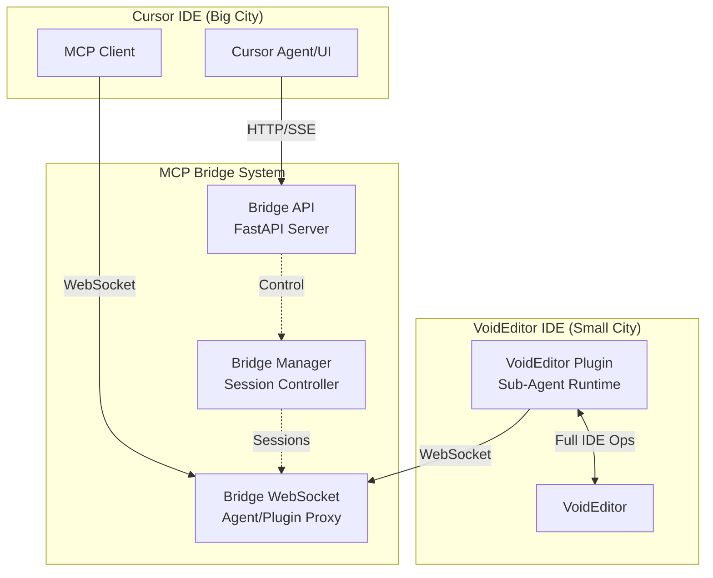
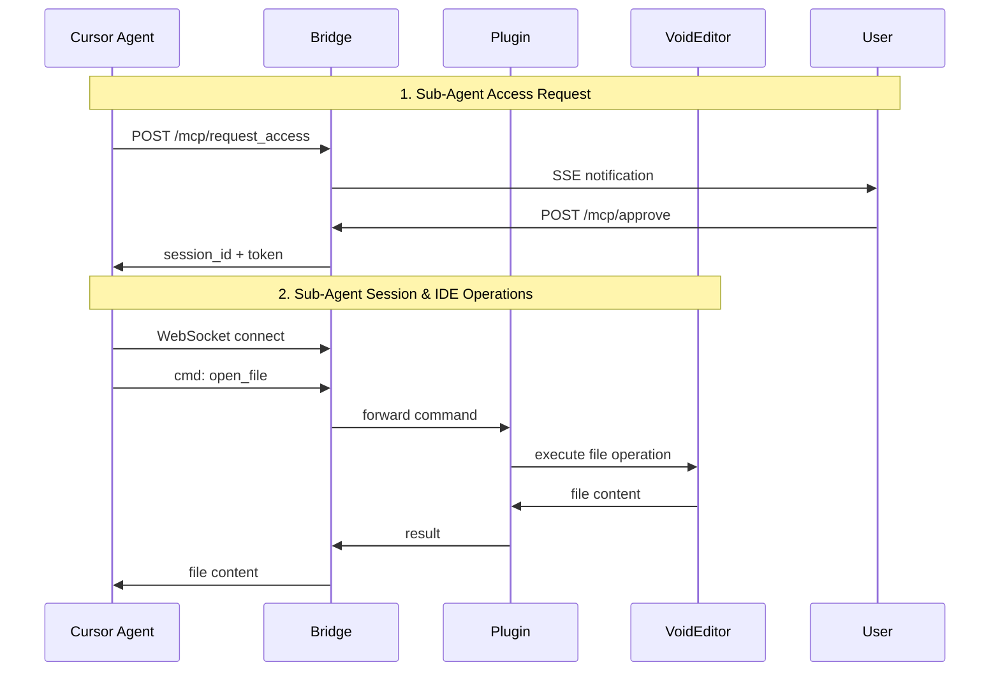
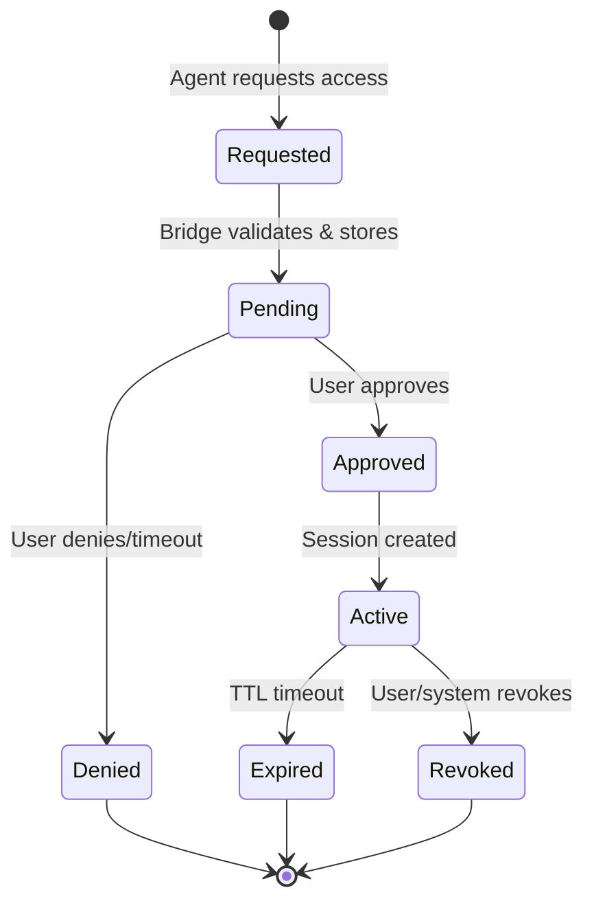
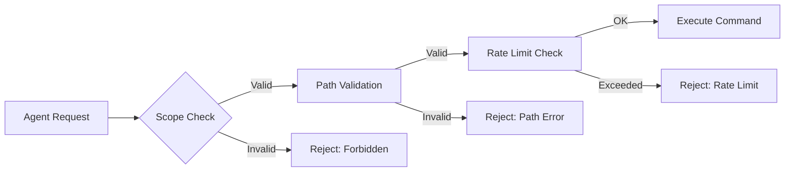

# MCP VoidEditor Bridge — Architecture & Design

> **Language**: [🇺🇸 English](ARCHITECTURE.md) | [🇮🇩 Bahasa Indonesia](docs_id/ARCHITECTURE.md)

**Detailed system architecture, data models, and component interactions for MCP Bridge enabling sub-agents in VoidEditor**

## 🏗️ System Architecture

### High-Level Component Diagram



### Data Flow Architecture



---

## 🔧 Component Details

### 1. Cursor Integration Layer

**Role**: Interface with Cursor IDE and agents  
**Technology**: HTTP Client, MCP Protocol  
**Communication**: REST API, Server-Sent Events, WebSocket

**Responsibilities**:

- Send access requests when sub-agents need VoidEditor access
- Display user consent modals for approval/denial
- Manage session status and provide revoke controls
- Handle real-time notifications from bridge

**Key Interfaces**:

```python
class CursorIntegration:
    def request_access(agent_id, scopes, roots, reason)
    def approve_request(request_id, approved_scopes, ttl)
    def deny_request(request_id, reason)
    def revoke_session(session_id)
    def listen_notifications()
```

### 2. Bridge Core (FastAPI Server)

**Role**: Central coordinator and security enforcement  
**Technology**: FastAPI, WebSocket, asyncio  
**Port**: 8787 (default, configurable)

**Responsibilities**:

- Handle HTTP management endpoints
- Enforce security policies and scope validation
- Manage session lifecycle and token generation
- Proxy WebSocket messages between agents and plugins
- Audit logging and monitoring

**Key Endpoints**:

```python
POST /mcp/request_access    # New access requests
GET  /mcp/requests         # List pending requests
POST /mcp/approve          # Approve requests
POST /mcp/deny             # Deny requests
POST /mcp/revoke           # Revoke active sessions
GET  /mcp/events           # SSE event stream
WS   /mcp/session/{id}     # Agent WebSocket
WS   /plugin/{id}          # Plugin WebSocket
```

### 3. Session Manager

**Role**: Session and token lifecycle management  
**Technology**: In-memory with optional persistence

**Responsibilities**:

- Generate and validate ephemeral session tokens
- Track session expiration and cleanup
- Enforce rate limits and concurrent session limits
- Maintain session state and metadata

**Key Features**:

- Token TTL enforcement (default 5 minutes)
- Automatic session cleanup on expiration
- Scope-based permission validation
- Rate limiting per session
- Audit trail for all session activities

### 4. WebSocket Proxy

**Role**: Real-time message forwarding and filtering  
**Technology**: WebSocket, JSON message protocol

**Responsibilities**:

- Maintain persistent connections to agents and plugins
- Validate messages against session scopes
- Forward authorized commands from agents to plugins
- Relay results and events back to agents
- Handle connection failures and reconnection

**Message Flow**:

```
Agent → WebSocket → Scope Validation → Plugin → VoidEditor
VoidEditor → Plugin → Event → WebSocket → Agent
```

### 5. VoidEditor Plugin (Sub-Agent Runtime)

**Role**: Execute IDE operations within VoidEditor  
**Technology**: JavaScript/TypeScript, WebSocket client

**Responsibilities**:

- Connect to bridge and maintain session
- Execute file operations, code analysis, terminal commands
- Provide real-time editor state synchronization
- Handle user interactions and system events
- Implement security boundaries for sub-agent operations

**Capabilities**:

- **File Operations**: CRUD operations on files and directories
- **Buffer Management**: Editor buffer manipulation and synchronization
- **Code Analysis**: Syntax analysis, error detection, completions
- **Project Management**: Workspace exploration, build, testing
- **Terminal Integration**: Command execution and output streaming
- **Version Control**: Git operations and repository management
- **Real-time Sync**: Cursor, selection, viewport synchronization

---

## 📊 Data Models & Schemas

### Request Management

```python
@dataclass
class AccessRequest:
    request_id: str                    # UUID for request identification
    agent_id: str                      # Agent requesting access
    scopes: List[str]                  # Requested permissions
    roots: List[str]                   # Allowed file paths
    reason: str                        # Human-readable justification
    status: RequestStatus              # PENDING, APPROVED, DENIED
    created_at: datetime               # Request timestamp
    approved_by: Optional[str] = None  # User who approved/denied
    session_id: Optional[str] = None   # Created session ID
    metadata: Dict[str, Any] = None    # Additional context

class RequestStatus(Enum):
    PENDING = "pending"
    APPROVED = "approved"
    DENIED = "denied"
    EXPIRED = "expired"
```

### Session Management

```python
@dataclass
class Session:
    session_id: str                    # UUID for session identification
    token: str                         # Ephemeral session token
    agent_id: str                      # Associated agent
    expires_at: datetime               # Session expiration time
    allowed_scopes: List[str]          # Permitted operations
    allowed_roots: List[str]           # Permitted file paths
    created_at: datetime               # Session creation time
    last_activity: datetime            # Last activity timestamp
    request_count: int                 # Number of requests processed
    status: SessionStatus              # Session state
    ws_agent: Optional[WebSocket]      # Agent WebSocket connection
    ws_plugin: Optional[WebSocket]     # Plugin WebSocket connection
    created_by_request: str            # Originating request ID

class SessionStatus(Enum):
    ACTIVE = "active"
    EXPIRED = "expired"
    REVOKED = "revoked"
    DISCONNECTED = "disconnected"
```

### Message Protocol

**Command Messages (Agent → Plugin)**:

```python
@dataclass
class Command:
    type: str = "cmd"                  # Message type identifier
    id: str                            # Unique command ID
    action: str                        # Specific action to perform
    args: Dict[str, Any]               # Action parameters
    session_id: str                    # Session context

# Example actions by category:
FILE_OPERATIONS = [
    "open_file", "create_file", "delete_file", "rename_file",
    "search_files", "watch_file", "get_file_info"
]

BUFFER_MANAGEMENT = [
    "get_buffers", "edit_buffer", "switch_buffer", "split_pane",
    "close_buffer", "save_buffer", "get_buffer_content"
]

CODE_ANALYSIS = [
    "analyze_syntax", "get_errors", "get_completions", "format_code",
    "goto_definition", "find_references", "get_symbols"
]
```

**Result Messages (Plugin → Agent)**:

```python
@dataclass
class Result:
    type: str = "result"               # Message type identifier
    id: str                            # Matching command ID
    status: str                        # "ok", "error", "timeout"
    data: Optional[Dict[str, Any]]     # Success data
    error: Optional[Dict[str, Any]]    # Error information
    timestamp: datetime                # Result timestamp
```

**Event Messages (Plugin → Agent)**:

```python
@dataclass
class Event:
    type: str = "event"                # Message type identifier
    event: str                         # Event category
    data: Dict[str, Any]               # Event data
    timestamp: datetime                # Event timestamp
    session_id: str                    # Session context

# Event categories:
EDITOR_EVENTS = [
    "buffer_changed", "cursor_moved", "selection_changed",
    "viewport_changed", "file_saved", "file_opened"
]

PROJECT_EVENTS = [
    "build_started", "build_completed", "test_results",
    "workspace_changed", "config_updated"
]
```

### Audit Trail

```python
@dataclass
class AuditEntry:
    timestamp: datetime                # Entry timestamp
    session_id: str                    # Associated session
    request_id: str                    # Associated request
    actor: str                         # Agent or user ID
    action: str                        # Action performed
    args: Dict[str, Any]               # Action parameters
    result: str                        # Success/failure
    duration_ms: float                 # Execution time
    scope_check: bool                  # Scope validation result
    error_details: Optional[str]       # Error information
```

---

## 🔄 Protocol Flow Details

### 1. Access Request Flow



### 2. Session Lifecycle Management

1. **Session Creation**

   ```python
   def create_session(request: AccessRequest, ttl_seconds: int) -> Session:
       session = Session(
           session_id=generate_uuid(),
           token=generate_secure_token(),
           agent_id=request.agent_id,
           expires_at=datetime.utcnow() + timedelta(seconds=ttl_seconds),
           allowed_scopes=request.scopes,
           allowed_roots=request.roots
       )
       return session
   ```

2. **Scope Validation**

   ```python
   def validate_command(command: Command, session: Session) -> bool:
       # Check if action is allowed by session scopes
       required_scope = get_required_scope(command.action)
       if required_scope not in session.allowed_scopes:
           return False

       # Validate file paths against allowed roots
       if 'path' in command.args:
           if not is_path_allowed(command.args['path'], session.allowed_roots):
               return False

       return True
   ```

3. **Message Forwarding**
   ```python
   async def forward_command(command: Command, session: Session):
       # Validate command against session scopes
       if not validate_command(command, session):
           await send_error(session.ws_agent, command.id, "forbidden")
           return

       # Forward to plugin
       if session.ws_plugin:
           await session.ws_plugin.send_json(command.dict())

       # Log action
       audit_log.append(AuditEntry(
           session_id=session.session_id,
           action=command.action,
           args=command.args,
           timestamp=datetime.utcnow()
       ))
   ```

### 3. Real-time Event Processing

```python
async def handle_plugin_event(event: Event, session: Session):
    # Filter events based on session scope
    if not should_forward_event(event, session):
        return

    # Forward to agent
    if session.ws_agent:
        await session.ws_agent.send_json(event.dict())

    # Update session activity
    session.last_activity = datetime.utcnow()
```

---

## 🔒 Security Architecture

### Permission Model



### Security Layers

1. **Authentication & Authorization**

   - Management endpoints protected by `MCP_TOKEN`
   - Session access controlled by ephemeral tokens
   - Scope-based permission validation

2. **Path Security**

   ```python
   def validate_path(path: str, allowed_roots: List[str]) -> bool:
       # Resolve canonical path to prevent traversal attacks
       canonical_path = os.path.realpath(path)

       # Check if path is within allowed roots
       for root in allowed_roots:
           canonical_root = os.path.realpath(root)
           if canonical_path.startswith(canonical_root):
               return True

       return False
   ```

3. **Rate Limiting**

   ```python
   class RateLimiter:
       def __init__(self, max_requests: int, window_seconds: int):
           self.max_requests = max_requests
           self.window_seconds = window_seconds
           self.requests = defaultdict(deque)

       def check_limit(self, session_id: str) -> bool:
           now = time.time()
           session_requests = self.requests[session_id]

           # Remove old requests outside window
           while session_requests and session_requests[0] < now - self.window_seconds:
               session_requests.popleft()

           # Check if limit exceeded
           if len(session_requests) >= self.max_requests:
               return False

           session_requests.append(now)
           return True
   ```

4. **Audit & Monitoring**
   ```python
   class AuditLogger:
       def __init__(self, log_file: str):
           self.log_file = log_file

       def log_action(self, session: Session, action: str, args: dict, result: str):
           entry = {
               "timestamp": datetime.utcnow().isoformat(),
               "session_id": session.session_id,
               "agent_id": session.agent_id,
               "action": action,
               "args": args,
               "result": result,
               "scopes": session.allowed_scopes
           }

           with open(self.log_file, 'a') as f:
               f.write(json.dumps(entry) + '\n')
   ```

---

## ⚙️ Configuration & Environment

### Environment Variables

```bash
# Bridge Configuration
MCP_TOKEN=secure-management-token        # Bridge management secret
ALLOWED_ROOT=/home/user/projects         # Default allowed root path
HOST=127.0.0.1                          # Bind address
PORT=8787                                # HTTP/WebSocket port
SESSION_TTL=300                          # Session timeout (seconds)

# Security Configuration
MAX_CONCURRENT_SESSIONS=10               # Maximum active sessions
RATE_LIMIT_REQUESTS=10                   # Requests per window
RATE_LIMIT_WINDOW=60                     # Rate limit window (seconds)
MAX_EDIT_BYTES=102400                    # Maximum edit size (100KB)

# Logging Configuration
LOG_LEVEL=INFO                           # Logging verbosity
AUDIT_LOG_FILE=./logs/audit.log          # Audit trail location
ENABLE_DEBUG=false                       # Debug mode
```

### Runtime Configuration

```python
@dataclass
class BridgeConfig:
    # Server settings
    host: str = "127.0.0.1"
    port: int = 8787

    # Security settings
    mcp_token: str = field(default_factory=lambda: os.getenv("MCP_TOKEN"))
    allowed_roots: List[str] = field(default_factory=lambda: [os.getenv("ALLOWED_ROOT", ".")])
    session_ttl: int = 300

    # Limits
    max_concurrent_sessions: int = 10
    rate_limit_requests: int = 10
    rate_limit_window: int = 60
    max_edit_bytes: int = 102400

    # Logging
    log_level: str = "INFO"
    audit_log_file: str = "./logs/audit.log"
    enable_debug: bool = False

    @classmethod
    def from_env(cls) -> 'BridgeConfig':
        return cls(
            host=os.getenv("HOST", "127.0.0.1"),
            port=int(os.getenv("PORT", "8787")),
            session_ttl=int(os.getenv("SESSION_TTL", "300")),
            # ... load other settings
        )
```

---

## 🎯 Performance Considerations

### 1. Scalability Design

- **Async/await throughout** for non-blocking I/O
- **Connection pooling** for WebSocket management
- **In-memory session storage** with optional Redis backend
- **Background cleanup tasks** for expired sessions

### 2. Resource Management

```python
class ResourceManager:
    def __init__(self, config: BridgeConfig):
        self.active_sessions = {}
        self.pending_requests = {}
        self.websocket_connections = {}
        self.rate_limiters = {}

    async def cleanup_expired_sessions(self):
        """Background task to clean up expired sessions"""
        now = datetime.utcnow()
        expired_sessions = [
            session_id for session_id, session in self.active_sessions.items()
            if session.expires_at < now
        ]

        for session_id in expired_sessions:
            await self.revoke_session(session_id, "expired")

    async def monitor_resource_usage(self):
        """Monitor system resource usage"""
        return {
            "active_sessions": len(self.active_sessions),
            "pending_requests": len(self.pending_requests),
            "websocket_connections": len(self.websocket_connections),
            "memory_usage": psutil.Process().memory_info().rss / 1024 / 1024
        }
```

### 3. Connection Management

```python
class WebSocketManager:
    def __init__(self):
        self.agent_connections = {}
        self.plugin_connections = {}

    async def handle_agent_connection(self, websocket: WebSocket, session_id: str):
        session = get_session(session_id)
        if not session or not session.is_valid():
            await websocket.close(code=1008, reason="Invalid session")
            return

        self.agent_connections[session_id] = websocket
        session.ws_agent = websocket

        try:
            async for message in websocket.iter_json():
                await self.process_agent_message(message, session)
        except WebSocketDisconnect:
            logger.info(f"Agent disconnected: {session_id}")
        finally:
            self.cleanup_connection(session_id)
```

---

**Next**: See [API_SPECIFICATION.md](API_SPECIFICATION.md) for complete API documentation
