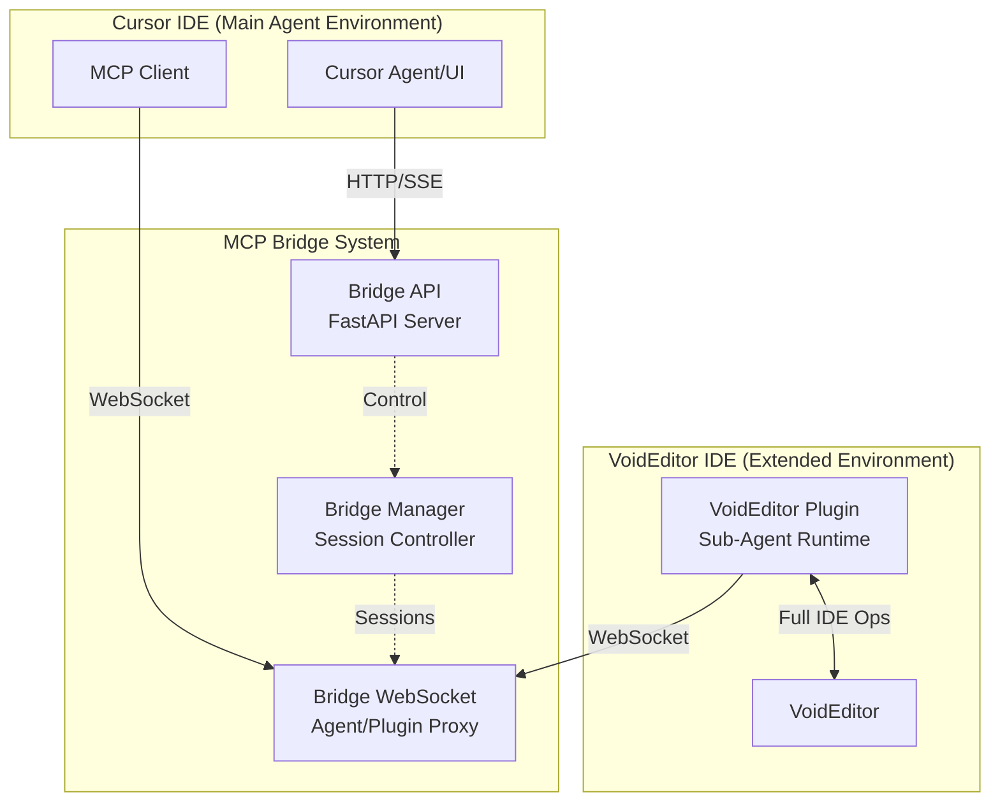
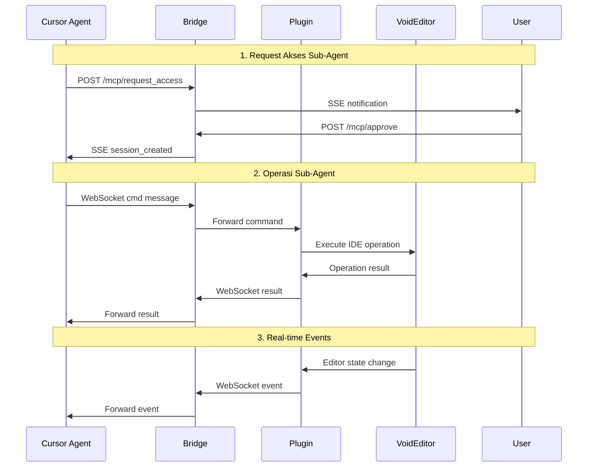
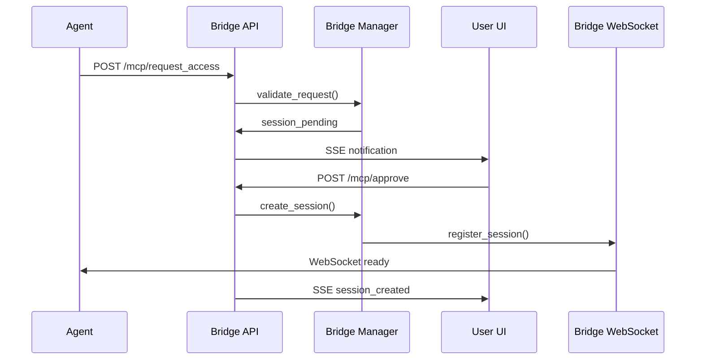
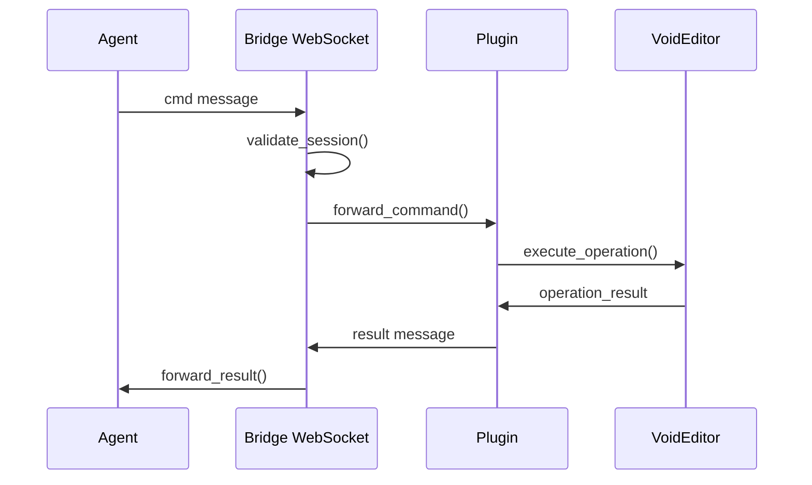
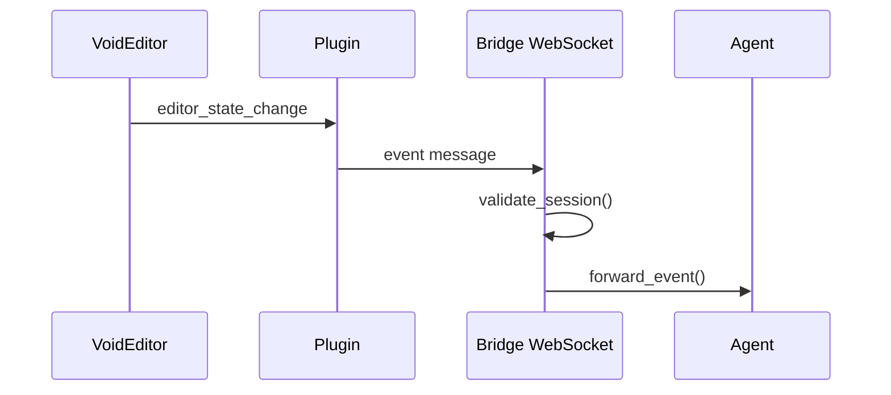

# MCP VoidEditor Bridge — Arsitektur & Desain

> **Bahasa**: [🇺🇸 English](../ARCHITECTURE.md) | [🇮🇩 Bahasa Indonesia](ARCHITECTURE.md)

**Arsitektur sistem detail, model data, dan interaksi komponen untuk MCP Bridge yang memungkinkan sub-agent di VoidEditor**

## 🏗️ Arsitektur Sistem

### Diagram Komponen Tingkat Tinggi



### Arsitektur Alur Data



## 🧩 Komponen Utama

### 1. Cursor Agent (Main Agent Environment)

**Tanggung Jawab:**

- Mengirim request akses ke VoidEditor
- Menampilkan UI persetujuan pengguna
- Mengelola sesi sub-agent
- Menerima notifikasi real-time

**Teknologi:**

- MCP Client untuk komunikasi dengan Bridge
- UI untuk persetujuan dan monitoring
- WebSocket client untuk komunikasi real-time

### 2. MCP Bridge System

#### Bridge API (FastAPI Server)

**Tanggung Jawab:**

- Endpoint HTTP untuk request akses
- Manajemen sesi dan autentikasi
- Notifikasi SSE ke Cursor UI
- Logging dan audit

**Endpoint Utama:**

```python
POST /mcp/request_access    # Request akses sub-agent
POST /mcp/approve          # Persetujuan pengguna
POST /mcp/deny            # Penolakan pengguna
GET  /mcp/sessions        # Status sesi aktif
POST /mcp/revoke          # Pencabutan sesi
GET  /mcp/health          # Health check
```

#### Bridge Manager (Session Controller)

**Tanggung Jawab:**

- Manajemen lifecycle sesi
- Validasi scope dan izin
- Enforce policy keamanan
- Cleanup sesi expired

**Fitur:**

- Token-based authentication
- Scope-based access control
- TTL management
- Audit logging

#### Bridge WebSocket (Agent/Plugin Proxy)

**Tanggung Jawab:**

- Proxy komunikasi real-time
- Message routing antara agent dan plugin
- Session validation
- Error handling

### 3. VoidEditor Plugin (Sub-Agent Runtime)

**Tanggung Jawab:**

- Koneksi ke Bridge via WebSocket
- Eksekusi operasi IDE lengkap
- Real-time state synchronization
- Error reporting

**Kemampuan IDE:**

- File operations (CRUD)
- Code analysis dan formatting
- Terminal integration
- Version control (Git)
- Search dan replace
- Project management
- Real-time editor state sync

## 📊 Model Data

### Session Management

```python
class Session:
    session_id: str
    agent_id: str
    plugin_id: str
    scopes: List[str]
    root_path: str
    created_at: datetime
    expires_at: datetime
    status: SessionStatus
    last_activity: datetime
```

### MCP Message Format

```python
class MCPMessage:
    type: str  # "cmd" | "result" | "event"
    session_id: str
    timestamp: datetime
    data: Dict[str, Any]
```

### Command Structure

```python
class Command:
    action: str
    params: Dict[str, Any]
    scope: str
    timeout: Optional[int]
```

### Event Structure

```python
class Event:
    event_type: str
    data: Dict[str, Any]
    timestamp: datetime
```

## 🔄 Interaksi Komponen

### 1. Request Access Flow



### 2. Command Execution Flow



### 3. Real-time Event Flow



## 🛡️ Keamanan & Isolasi

### Session Isolation

- Setiap sesi memiliki token unik
- Scope-based access control
- Root path restriction
- TTL enforcement

### Communication Security

- WebSocket over localhost only
- Token validation pada setiap request
- Message encryption (optional)
- Audit logging

### Error Handling

- Graceful degradation
- Session cleanup on errors
- User notification
- Recovery mechanisms

## 📈 Performance Considerations

### Scalability

- Stateless bridge design
- Session pooling
- Connection multiplexing
- Resource monitoring

### Optimization

- Message batching
- Compression
- Caching
- Lazy loading

## 🔧 Configuration

### Bridge Configuration

```yaml
bridge:
  host: "127.0.0.1"
  port: 8787
  max_sessions: 10
  session_ttl: 300
  allowed_roots: ["/workspace"]
```

### Plugin Configuration

```yaml
plugin:
  bridge_url: "ws://127.0.0.1:8787/ws"
  reconnect_interval: 5
  max_retries: 3
  heartbeat_interval: 30
```

## 🧪 Testing Strategy

### Unit Tests

- Component isolation
- Mock dependencies
- Edge case coverage
- Performance benchmarks

### Integration Tests

- End-to-end workflows
- Multi-component scenarios
- Error conditions
- Security validation

### Load Tests

- Concurrent sessions
- Message throughput
- Resource usage
- Failure recovery

## 📚 Monitoring & Observability

### Metrics

- Session count
- Command latency
- Error rates
- Resource usage

### Logging

- Structured logging
- Audit trails
- Error tracking
- Performance metrics

### Alerting

- Session failures
- High latency
- Resource exhaustion
- Security violations

---

**Arsitektur ini dirancang untuk memberikan kontrol sub-agent yang aman dan efisien di VoidEditor sambil menjaga keamanan dan auditabilitas yang ketat.**
