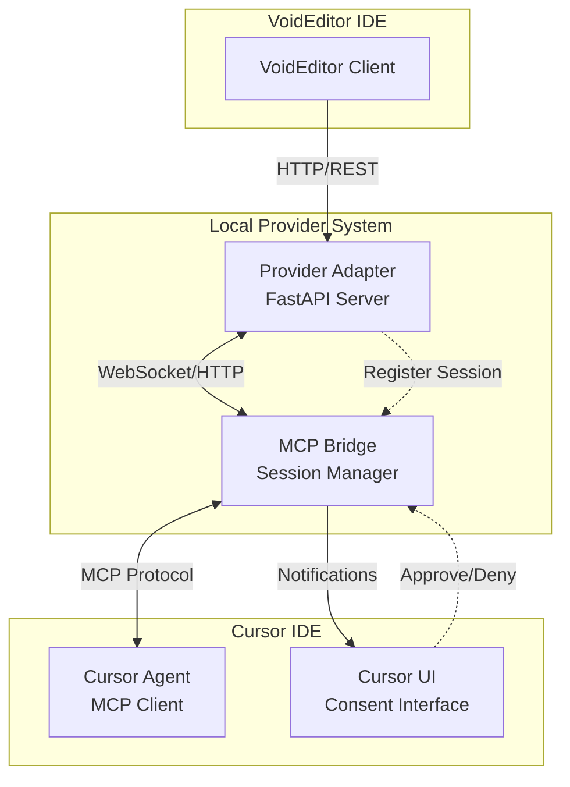
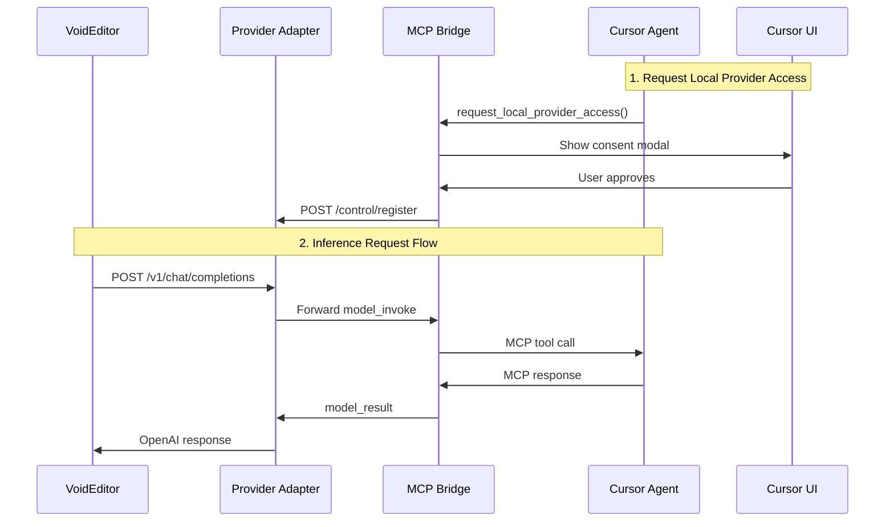
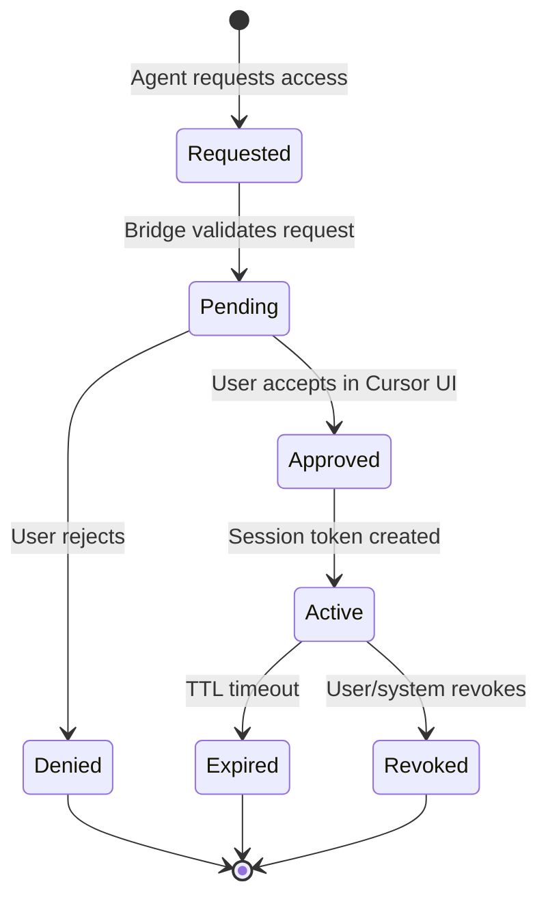
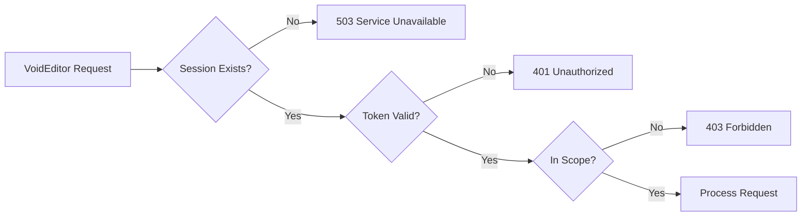

# MCP Local Provider — Architecture & Design

> **Language**: [🇺🇸 English](ARCHITECTURE.md) | [🇮🇩 Bahasa Indonesia](docs_id/ARCHITECTURE.md)

> **Detailed system architecture, data models, and component interactions**

## 🏗️ System Architecture

### High-Level Component Diagram



### Data Flow Architecture



---

## 🔧 Component Details

### 1. VoidEditor (Client)

**Role**: IDE that needs AI model access  
**Technology**: Any IDE with Local Provider support  
**Configuration**: Points to `http://127.0.0.1:11434`

**Capabilities**:

- Send chat completion requests
- Handle streaming responses
- Configure model parameters
- Display AI responses in IDE interface

### 2. Provider Adapter (FastAPI Server)

**Role**: Protocol translator between VoidEditor and MCP  
**Technology**: FastAPI, Uvicorn  
**Port**: 11434 (default, configurable)

**Responsibilities**:

- Expose OpenAI-compatible API endpoints
- Translate HTTP requests to MCP messages
- Handle session registration and validation
- Stream response forwarding
- Request/response logging and audit

**Key Endpoints**:

```python
GET  /health                    # Health check
POST /v1/chat/completions      # OpenAI-compatible chat
POST /api/generate             # Ollama-compatible (fallback)
POST /control/register         # Internal session registration
GET  /v1/models               # Available models metadata
```

### 3. MCP Bridge (Session Manager)

**Role**: Central coordinator for session and security  
**Technology**: Python, WebSocket, HTTP client

**Responsibilities**:

- Session lifecycle management (create, validate, expire, revoke)
- User consent workflow
- Request access control and scope validation
- Message forwarding between Adapter and Agent
- Audit logging and security enforcement

**Key Features**:

- Ephemeral session tokens with TTL
- Real-time session status tracking
- Multi-session support
- Event notifications to Cursor UI

### 4. Cursor Agent (MCP Client)

**Role**: AI agent that processes inference requests  
**Technology**: MCP Client Library (Python/TypeScript)

**Responsibilities**:

- Handle `model_invoke` MCP tool calls
- Process chat completion requests
- Generate streaming or complete responses
- Maintain conversation context
- Integrate with Cursor's AI capabilities

---

## 📊 Data Models & Schemas

### Session Management

```python
@dataclass
class Session:
    session_id: str                    # UUID for session identification
    agent_id: str                      # Cursor agent identifier
    session_token: str                 # Ephemeral authentication token
    allowed_scopes: List[str]          # Permitted actions ["inference"]
    created_at: datetime               # Session creation timestamp
    expires_at: datetime               # TTL expiry time
    status: SessionStatus              # ACTIVE, EXPIRED, REVOKED
    last_activity: datetime            # Last request timestamp
    request_count: int                 # Number of requests processed
    label: str                         # Human-readable session name

class SessionStatus(Enum):
    ACTIVE = "active"
    EXPIRED = "expired"
    REVOKED = "revoked"
    PENDING = "pending"
```

### MCP Message Formats

**Model Invoke Request (Adapter → Agent)**:

```python
@dataclass
class ModelInvokeRequest:
    type: str = "model_invoke"         # Message type identifier
    id: str                            # Request UUID
    session_id: str                    # Active session reference
    model_meta: ModelMetadata          # Provider and model information
    payload: InferencePayload          # Actual inference request

@dataclass
class ModelMetadata:
    provider: str = "mcp-proxy"        # Provider identifier
    label: str                         # Human-readable model name
    requested_scopes: List[str]        # Required permissions

@dataclass
class InferencePayload:
    kind: str                          # "chat", "completion", "embedding"
    messages: List[ChatMessage]        # Conversation history
    parameters: GenerationParameters   # Model parameters

@dataclass
class GenerationParameters:
    max_tokens: int = 512              # Maximum output tokens
    temperature: float = 0.8           # Sampling temperature
    stream: bool = False               # Enable streaming response
    top_p: float = 0.9                # Nucleus sampling parameter
    frequency_penalty: float = 0.0     # Repetition penalty
```

**Model Result Response (Agent → Adapter)**:

```python
@dataclass
class ModelResultResponse:
    type: str = "model_result"         # Response type
    id: str                            # Matching request ID
    status: str                        # "ok", "error", "timeout"
    result: InferenceResult            # Generated content

@dataclass
class InferenceResult:
    choices: List[CompletionChoice]    # Generated alternatives
    usage: TokenUsage                  # Token consumption statistics
    model: str                         # Model identifier used
    created: int                       # Unix timestamp

@dataclass
class CompletionChoice:
    index: int                         # Choice ranking
    message: ChatMessage               # Generated message
    finish_reason: str                 # "stop", "length", "content_filter"

@dataclass
class TokenUsage:
    prompt_tokens: int                 # Input tokens consumed
    completion_tokens: int             # Output tokens generated
    total_tokens: int                  # Total tokens used
```

**Streaming Response (Agent → Adapter)**:

```python
@dataclass
class ModelStreamChunk:
    type: str = "model_stream_chunk"   # Streaming chunk type
    id: str                            # Matching request ID
    chunk_index: int                   # Sequential chunk number
    delta: StreamDelta                 # Incremental content
    finish_reason: Optional[str]       # End marker if final chunk

@dataclass
class StreamDelta:
    role: Optional[str]                # Message role (first chunk only)
    content: str                       # Incremental text content
```

---

## 🔄 Protocol Flow Details

### 1. Session Establishment Flow



### 2. Request Processing Pipeline

1. **HTTP Request Reception**

   ```python
   POST /v1/chat/completions
   Content-Type: application/json
   {
     "model": "cursor-agent",
     "messages": [...],
     "temperature": 0.7,
     "stream": false
   }
   ```

2. **Session Validation**

   ```python
   session = get_active_session(session_hint)
   if not session or session.is_expired():
       raise HTTPException(503, "No active agent session")
   ```

3. **MCP Message Translation**

   ```python
   invoke_request = ModelInvokeRequest(
       id=generate_uuid(),
       session_id=session.session_id,
       payload=translate_openai_to_mcp(request_body)
   )
   ```

4. **Agent Communication**

   ```python
   result = await mcp_bridge.send_and_wait(
       invoke_request,
       timeout=30
   )
   ```

5. **Response Translation**
   ```python
   openai_response = translate_mcp_to_openai(result)
   return JSONResponse(openai_response)
   ```

### 3. Streaming Response Handling

```python
async def handle_streaming_response(request):
    async def generate_stream():
        async for chunk in mcp_bridge.stream(request):
            yield format_sse_chunk(chunk)

    return StreamingResponse(
        generate_stream(),
        media_type="text/event-stream"
    )
```

---

## 🔒 Security Architecture

### Authentication & Authorization



### Session Security Model

1. **Multi-layer Validation**

   - Session existence check
   - Token signature validation
   - TTL expiration check
   - Scope permission verification
   - Rate limit enforcement

2. **Token Management**

   ```python
   class SecureToken:
       payload: str           # Session data
       signature: str         # HMAC signature
       issued_at: datetime    # Creation time
       expires_at: datetime   # Expiration time

       def is_valid(self) -> bool:
           return (
               self.verify_signature() and
               not self.is_expired() and
               self.check_rate_limits()
           )
   ```

3. **Audit Trail**
   ```python
   @dataclass
   class AuditLogEntry:
       timestamp: datetime
       session_id: str
       agent_id: str
       action: str                # "invoke", "stream", "register"
       request_id: str
       prompt_hash: str           # SHA256 of input
       response_size: int         # Response length
       duration_ms: int           # Processing time
       status: str                # "success", "error", "timeout"
       error_details: Optional[str]
   ```

---

## ⚙️ Configuration & Environment

### Environment Variables

```bash
# Provider Adapter Configuration
ADAPTER_PORT=11434                    # HTTP server port
ADAPTER_HOST=127.0.0.1               # Bind address (localhost only)
ADAPTER_WORKERS=1                     # Uvicorn worker processes

# MCP Bridge Configuration
MCP_BRIDGE_URL=ws://127.0.0.1:8787   # Bridge WebSocket endpoint
MCP_BRIDGE_TOKEN=dev-token-secret     # Bridge authentication token

# Security Configuration
SESSION_TTL_SECONDS=300               # Session timeout (5 minutes)
MAX_REQUESTS_PER_SESSION=100          # Rate limiting
MAX_TOKEN_LENGTH=8192                 # Maximum input size
ENABLE_STREAMING=true                 # Streaming response support

# Logging Configuration
LOG_LEVEL=INFO                        # Logging verbosity
AUDIT_LOG_FILE=./logs/audit.jsonl     # Audit trail location
ENABLE_DEBUG_LOGS=false               # Debug mode
```

### Runtime Configuration

```python
@dataclass
class AdapterConfig:
    # Server settings
    host: str = "127.0.0.1"
    port: int = 11434
    workers: int = 1

    # MCP Bridge connection
    bridge_url: str = "ws://127.0.0.1:8787"
    bridge_token: str = "dev-token"

    # Security settings
    session_ttl: int = 300
    max_requests: int = 100
    max_token_length: int = 8192

    # Feature flags
    enable_streaming: bool = True
    enable_ollama_compat: bool = True
    enable_debug: bool = False

    @classmethod
    def from_env(cls) -> 'AdapterConfig':
        return cls(
            host=os.getenv("ADAPTER_HOST", "127.0.0.1"),
            port=int(os.getenv("ADAPTER_PORT", "11434")),
            # ... load other settings
        )
```

---

## 🎯 Performance Considerations

### 1. Concurrency Model

- **Async/await throughout** for non-blocking I/O
- **Connection pooling** for MCP Bridge WebSocket
- **Request queuing** with backpressure handling
- **Streaming optimization** for large responses

### 2. Resource Management

```python
class ResourceManager:
    def __init__(self):
        self.active_sessions = {}        # Session tracking
        self.connection_pool = Pool()    # WebSocket pool
        self.rate_limiters = {}          # Per-session rate limits

    async def cleanup_expired_sessions(self):
        """Periodic cleanup of expired sessions"""

    async def health_check(self) -> HealthStatus:
        """Monitor system health and capacity"""
```

### 3. Monitoring & Metrics

```python
@dataclass
class SystemMetrics:
    active_sessions: int
    total_requests: int
    average_latency_ms: float
    error_rate: float
    throughput_rps: float
    memory_usage_mb: float
    connection_pool_size: int
```

---

**Next**: See [API_SPECIFICATION.md](API_SPECIFICATION.md) for complete API documentation
