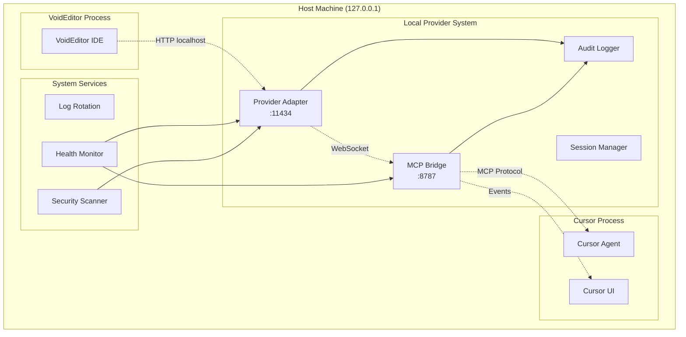

# MCP Local Provider — Deployment & Security

> **Production-ready deployment guide with comprehensive security measures**

## 🚀 Deployment Overview

The MCP Local Provider system consists of multiple components that must be deployed and configured securely. This guide covers production deployment, security hardening, monitoring, and operational best practices.

---

## 🏗️ Deployment Architecture

### Production Topology



---

## 🔧 Installation & Setup

### 1. System Requirements

**Minimum Requirements:**

- Python 3.10+
- RAM: 512MB available
- Disk: 1GB available space
- Network: Localhost/loopback only

**Recommended Requirements:**

- Python 3.11+
- RAM: 2GB available
- Disk: 5GB available space
- CPU: 2+ cores for concurrent processing

### 2. Environment Setup

```bash
# Create project directory
mkdir -p /opt/mcp-local-provider
cd /opt/mcp-local-provider

# Create Python virtual environment
python3.11 -m venv venv
source venv/bin/activate

# Install dependencies
pip install -r requirements.txt

# Create required directories
mkdir -p logs config data
```

### 3. Configuration Files

#### `.env` Configuration

```bash
# Server Configuration
ADAPTER_HOST=127.0.0.1
ADAPTER_PORT=11434
ADAPTER_WORKERS=1

# MCP Bridge Configuration
MCP_BRIDGE_URL=ws://127.0.0.1:8787
MCP_BRIDGE_TOKEN=CHANGE_THIS_SECRET_TOKEN_NOW

# Security Configuration
SESSION_TTL_SECONDS=300
MAX_REQUESTS_PER_SESSION=100
MAX_TOKEN_LENGTH=8192
ENABLE_RATE_LIMITING=true

# Logging Configuration
LOG_LEVEL=INFO
AUDIT_LOG_FILE=/opt/mcp-local-provider/logs/audit.jsonl
ERROR_LOG_FILE=/opt/mcp-local-provider/logs/error.log
ACCESS_LOG_FILE=/opt/mcp-local-provider/logs/access.log

# Performance Configuration
REQUEST_TIMEOUT_SECONDS=30
STREAM_TIMEOUT_SECONDS=60
MAX_CONCURRENT_REQUESTS=10

# Feature Flags
ENABLE_STREAMING=true
ENABLE_OLLAMA_COMPAT=true
ENABLE_DEBUG_ENDPOINTS=false
ENABLE_METRICS=true
```

#### `config/security.yaml`

```yaml
security:
  # Network Security
  allowed_hosts:
    - 127.0.0.1
    - ::1
    - localhost

  # Session Security
  session:
    max_concurrent: 5
    cleanup_interval_seconds: 60
    token_rotation_enabled: false

  # Request Security
  request:
    max_size_bytes: 10485760 # 10MB
    max_headers: 100
    max_query_params: 50

  # Rate Limiting
  rate_limiting:
    enabled: true
    window_seconds: 300
    max_requests: 100
    burst_allowance: 10

  # Content Security
  content:
    max_prompt_length: 8192
    allowed_content_types:
      - application/json
      - text/event-stream

  # Audit Configuration
  audit:
    enabled: true
    log_requests: true
    log_responses: false # Don't log response content
    log_errors: true
    retention_days: 30
```

---

## 🔒 Security Hardening

### 1. Network Security

#### Localhost Binding Only

```python
# Enforce localhost binding
ALLOWED_HOSTS = ["127.0.0.1", "::1", "localhost"]

@app.middleware("http")
async def enforce_localhost(request: Request, call_next):
    client_host = request.client.host
    if client_host not in ALLOWED_HOSTS:
        logger.warning(f"Blocked non-localhost request from {client_host}")
        raise HTTPException(403, "Access denied: localhost only")
    return await call_next(request)
```

#### Firewall Configuration (Linux)

```bash
# Block external access to provider port
sudo ufw deny from any to any port 11434
sudo ufw allow from 127.0.0.1 to any port 11434

# Block external access to MCP bridge port
sudo ufw deny from any to any port 8787
sudo ufw allow from 127.0.0.1 to any port 8787
```

### 2. Authentication & Authorization

#### Bridge Token Security

```python
import secrets
import hashlib

class SecureBridgeToken:
    def __init__(self):
        self.token = secrets.token_urlsafe(32)
        self.hash = hashlib.sha256(self.token.encode()).hexdigest()

    def verify(self, provided_token: str) -> bool:
        provided_hash = hashlib.sha256(provided_token.encode()).hexdigest()
        return secrets.compare_digest(self.hash, provided_hash)
```

#### Session Token Management

```python
@dataclass
class SecureSession:
    session_id: str
    token_hash: str        # Never store plain tokens
    created_at: datetime
    expires_at: datetime
    last_activity: datetime
    request_count: int
    max_requests: int = 100

    def is_valid(self) -> bool:
        now = datetime.utcnow()
        return (
            now < self.expires_at and
            self.request_count < self.max_requests
        )

    def verify_token(self, token: str) -> bool:
        token_hash = hashlib.sha256(token.encode()).hexdigest()
        return secrets.compare_digest(self.token_hash, token_hash)
```

### 3. Input Validation & Sanitization

#### Request Validation

```python
from pydantic import BaseModel, Field, validator

class SecureChatRequest(BaseModel):
    model: str = Field(default="cursor-agent", regex=r"^[a-zA-Z0-9\-_]+$")
    messages: List[ChatMessage] = Field(min_items=1, max_items=100)
    temperature: float = Field(ge=0.0, le=2.0, default=0.8)
    max_tokens: int = Field(ge=1, le=8192, default=512)
    stream: bool = Field(default=False)

    @validator('messages')
    def validate_messages(cls, v):
        total_length = sum(len(msg.content) for msg in v)
        if total_length > 100000:  # 100KB total
            raise ValueError("Total message content too large")
        return v

    @validator('messages', each_item=True)
    def validate_message_content(cls, v):
        # Sanitize potential code injection
        if any(dangerous in v.content.lower() for dangerous in
               ['<script', '<?php', 'exec(', 'eval(', 'import os']):
            raise ValueError("Potentially dangerous content detected")
        return v
```

### 4. Rate Limiting & DoS Protection

#### Advanced Rate Limiting

```python
import asyncio
from collections import defaultdict, deque

class AdaptiveRateLimiter:
    def __init__(self):
        self.requests = defaultdict(deque)
        self.blocked_ips = set()
        self.suspicious_patterns = defaultdict(int)

    async def check_rate_limit(self, session_id: str,
                              client_ip: str) -> bool:
        now = time.time()
        window = 300  # 5 minutes

        # Clean old requests
        session_requests = self.requests[session_id]
        while session_requests and session_requests[0] < now - window:
            session_requests.popleft()

        # Check current rate
        if len(session_requests) >= 100:  # Max 100 requests per 5 min
            self.suspicious_patterns[client_ip] += 1
            if self.suspicious_patterns[client_ip] > 3:
                self.blocked_ips.add(client_ip)
                logger.warning(f"Blocked suspicious IP: {client_ip}")
            return False

        session_requests.append(now)
        return True
```

### 5. Audit & Monitoring

#### Comprehensive Audit Logging

```python
@dataclass
class AuditLogEntry:
    timestamp: datetime
    event_type: str        # REQUEST, RESPONSE, ERROR, SECURITY
    session_id: str
    client_ip: str
    user_agent: str
    request_id: str
    endpoint: str
    method: str
    status_code: int
    processing_time_ms: int
    request_size_bytes: int
    response_size_bytes: int
    prompt_hash: Optional[str]  # SHA256 of prompt content
    error_details: Optional[str]
    security_flags: List[str]   # Any security concerns

class AuditLogger:
    def __init__(self, log_file: str):
        self.log_file = log_file
        self.logger = self._setup_logger()

    def log_request(self, request: Request, session_id: str):
        entry = AuditLogEntry(
            timestamp=datetime.utcnow(),
            event_type="REQUEST",
            session_id=session_id,
            client_ip=request.client.host,
            user_agent=request.headers.get("user-agent", ""),
            # ... populate other fields
        )
        self.logger.info(entry.to_json())

    def log_security_event(self, event: str, details: dict):
        entry = AuditLogEntry(
            timestamp=datetime.utcnow(),
            event_type="SECURITY",
            security_flags=[event],
            # ... populate other fields
        )
        self.logger.warning(entry.to_json())
```

---

## 📊 Monitoring & Observability

### 1. Health Monitoring

#### System Health Checks

```python
@dataclass
class HealthStatus:
    status: str           # healthy, degraded, unhealthy
    timestamp: datetime
    components: Dict[str, ComponentHealth]
    metrics: SystemMetrics

@dataclass
class ComponentHealth:
    name: str
    status: str
    last_check: datetime
    error_count: int
    latency_ms: float

class HealthMonitor:
    async def check_adapter_health(self) -> ComponentHealth:
        try:
            start = time.time()
            # Test adapter responsiveness
            response = await self.test_endpoint("/health")
            latency = (time.time() - start) * 1000

            return ComponentHealth(
                name="adapter",
                status="healthy" if response.status_code == 200 else "degraded",
                last_check=datetime.utcnow(),
                error_count=self.error_counts["adapter"],
                latency_ms=latency
            )
        except Exception as e:
            self.error_counts["adapter"] += 1
            return ComponentHealth(
                name="adapter",
                status="unhealthy",
                last_check=datetime.utcnow(),
                error_count=self.error_counts["adapter"],
                latency_ms=float('inf')
            )
```

### 2. Performance Metrics

#### Metrics Collection

```python
from dataclasses import dataclass
from typing import Dict
import psutil

@dataclass
class SystemMetrics:
    # Request metrics
    total_requests: int
    requests_per_second: float
    average_latency_ms: float
    error_rate: float

    # Session metrics
    active_sessions: int
    session_creation_rate: float
    session_expiry_rate: float

    # System metrics
    cpu_usage_percent: float
    memory_usage_mb: float
    disk_usage_mb: float
    network_io_mb: float

    # Application metrics
    connection_pool_size: int
    queue_depth: int
    cache_hit_rate: float

class MetricsCollector:
    def __init__(self):
        self.request_times = deque(maxlen=1000)
        self.error_counts = defaultdict(int)
        self.session_events = deque(maxlen=1000)

    def collect_system_metrics(self) -> SystemMetrics:
        # System resource usage
        cpu = psutil.cpu_percent()
        memory = psutil.Process().memory_info().rss / 1024 / 1024

        # Application metrics
        recent_requests = [t for t in self.request_times
                          if time.time() - t < 60]
        rps = len(recent_requests) / 60

        avg_latency = sum(self.latency_samples) / len(self.latency_samples) \
                     if self.latency_samples else 0

        return SystemMetrics(
            total_requests=len(self.request_times),
            requests_per_second=rps,
            average_latency_ms=avg_latency,
            error_rate=self.calculate_error_rate(),
            active_sessions=len(self.active_sessions),
            cpu_usage_percent=cpu,
            memory_usage_mb=memory,
            # ... populate other metrics
        )
```

### 3. Alerting & Notifications

#### Alert Configuration

```yaml
alerts:
  error_rate:
    threshold: 0.05 # 5% error rate
    window_minutes: 5
    severity: warning

  high_latency:
    threshold_ms: 5000 # 5 second response time
    window_minutes: 2
    severity: critical

  session_exhaustion:
    threshold: 0.9 # 90% of max sessions
    severity: warning

  security_breach:
    blocked_ips:
      threshold: 5 # 5 blocked IPs in window
      window_minutes: 10
      severity: critical

  resource_usage:
    cpu_threshold: 0.8 # 80% CPU
    memory_threshold: 0.9 # 90% memory
    severity: warning
```

---

## 🔧 Production Deployment

### 1. Systemd Service Configuration

#### `/etc/systemd/system/mcp-local-provider.service`

```ini
[Unit]
Description=MCP Local Provider Adapter
After=network.target
Requires=network.target

[Service]
Type=simple
User=mcp-provider
Group=mcp-provider
WorkingDirectory=/opt/mcp-local-provider
Environment=PATH=/opt/mcp-local-provider/venv/bin
ExecStart=/opt/mcp-local-provider/venv/bin/python adapter_provider.py
ExecReload=/bin/kill -HUP $MAINPID
Restart=always
RestartSec=5
StandardOutput=journal
StandardError=journal

# Security settings
NoNewPrivileges=true
PrivateTmp=true
ProtectSystem=strict
ProtectHome=true
ReadWritePaths=/opt/mcp-local-provider/logs
ReadWritePaths=/opt/mcp-local-provider/data

# Resource limits
LimitNOFILE=1024
LimitNPROC=512
MemoryMax=1G
CPUQuota=50%

[Install]
WantedBy=multi-user.target
```

#### Service Management

```bash
# Install and start service
sudo systemctl daemon-reload
sudo systemctl enable mcp-local-provider
sudo systemctl start mcp-local-provider

# Monitor service
sudo systemctl status mcp-local-provider
sudo journalctl -u mcp-local-provider -f
```

### 2. Log Rotation Configuration

#### `/etc/logrotate.d/mcp-local-provider`

```
/opt/mcp-local-provider/logs/*.log {
    daily
    missingok
    rotate 30
    compress
    notifempty
    create 644 mcp-provider mcp-provider
    sharedscripts
    postrotate
        systemctl reload mcp-local-provider
    endscript
}

/opt/mcp-local-provider/logs/*.jsonl {
    daily
    missingok
    rotate 90
    compress
    notifempty
    create 644 mcp-provider mcp-provider
}
```

### 3. Backup & Recovery

#### Backup Script

```bash
#!/bin/bash
# backup-mcp-provider.sh

BACKUP_DIR="/opt/backups/mcp-local-provider"
DATE=$(date +%Y%m%d_%H%M%S)
BACKUP_FILE="$BACKUP_DIR/mcp-provider-$DATE.tar.gz"

# Create backup
mkdir -p "$BACKUP_DIR"
tar -czf "$BACKUP_FILE" \
    --exclude='*.log' \
    --exclude='__pycache__' \
    /opt/mcp-local-provider/

# Retain only last 30 backups
find "$BACKUP_DIR" -name "mcp-provider-*.tar.gz" -mtime +30 -delete

echo "Backup created: $BACKUP_FILE"
```

---

## 🚨 Security Incident Response

### 1. Incident Detection

#### Automated Detection Rules

```python
class SecurityMonitor:
    def __init__(self):
        self.incident_handlers = {
            "rate_limit_exceeded": self.handle_rate_limit_incident,
            "invalid_token": self.handle_auth_incident,
            "suspicious_content": self.handle_content_incident,
            "external_access_attempt": self.handle_network_incident,
        }

    async def handle_rate_limit_incident(self, event: dict):
        # Temporarily block session
        session_id = event["session_id"]
        await self.session_manager.suspend_session(session_id,
                                                   reason="rate_limit_exceeded",
                                                   duration_minutes=15)

        # Alert administrators
        await self.send_alert({
            "severity": "medium",
            "type": "rate_limit_exceeded",
            "session_id": session_id,
            "action_taken": "session_suspended"
        })

    async def handle_auth_incident(self, event: dict):
        # Revoke session immediately
        session_id = event["session_id"]
        await self.session_manager.revoke_session(session_id,
                                                  reason="invalid_token")

        # Check for credential stuffing attack
        if self.detect_credential_stuffing(event["client_ip"]):
            await self.block_ip(event["client_ip"], duration_hours=24)
```

### 2. Incident Response Procedures

#### Response Playbook

```yaml
incident_response:
  security_breach:
    immediate_actions:
      - revoke_all_sessions
      - block_suspicious_ips
      - increase_logging_level
      - notify_administrators

    investigation_steps:
      - analyze_audit_logs
      - check_system_integrity
      - verify_configuration
      - review_recent_changes

    recovery_steps:
      - rotate_bridge_tokens
      - reset_session_counters
      - update_security_rules
      - restart_services

  performance_degradation:
    immediate_actions:
      - check_resource_usage
      - analyze_request_patterns
      - throttle_requests

    investigation_steps:
      - review_performance_metrics
      - check_mcp_bridge_connectivity
      - analyze_slow_queries

  service_unavailable:
    immediate_actions:
      - check_service_status
      - verify_network_connectivity
      - restart_failed_components

    recovery_steps:
      - restore_from_backup
      - validate_configuration
      - perform_health_checks
```

---

## ✅ Deployment Checklist

### Pre-Deployment

- [ ] **Security Review**

  - [ ] Change all default tokens and secrets
  - [ ] Verify localhost binding configuration
  - [ ] Test firewall rules
  - [ ] Review audit log configuration
  - [ ] Validate input sanitization

- [ ] **Performance Testing**

  - [ ] Load test with expected request volume
  - [ ] Verify response time SLAs
  - [ ] Test concurrent session limits
  - [ ] Validate streaming functionality

- [ ] **Integration Testing**
  - [ ] Test MCP Bridge connectivity
  - [ ] Verify Cursor Agent integration
  - [ ] Test VoidEditor configuration
  - [ ] Validate error handling

### Deployment

- [ ] **Service Deployment**

  - [ ] Deploy to production environment
  - [ ] Configure systemd service
  - [ ] Set up log rotation
  - [ ] Configure monitoring

- [ ] **Post-Deployment Validation**
  - [ ] Verify service health
  - [ ] Test basic functionality
  - [ ] Confirm security controls
  - [ ] Validate monitoring alerts

### Post-Deployment

- [ ] **Ongoing Monitoring**
  - [ ] Monitor system metrics
  - [ ] Review audit logs daily
  - [ ] Test incident response procedures
  - [ ] Update security configurations

---

**Next**: See [IMPLEMENTATION.md](IMPLEMENTATION.md) for complete code examples and starter templates
