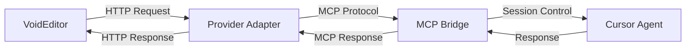

# MCP Local Provider — Agent as Local Model

> **Transform your Cursor Agent into a Local Provider for VoidEditor**

## 🎯 Overview

This project enables **Cursor Agents** to function as **Local Model Providers** for VoidEditor IDE. Think of it like sharing WiFi: Cursor (laptop with WiFi) shares its AI capabilities through a hotspot (Local Provider), allowing VoidEditor (phone) to access the same AI model.

### 📶 Concept Analogy

- **Cursor IDE** = Laptop with WiFi (AI capabilities)
- **VoidEditor** = Phone using laptop's hotspot (accessing AI through Local Provider)
- **Local Provider Adapter** = Hotspot sharing WiFi connection

---

## ✨ Key Benefits

- ✅ **Zero VoidEditor modification** — just configure endpoint
- ✅ **Full MCP control** — consent, scope, TTL still apply
- ✅ **Multi-provider compatibility** — OpenAI/Ollama/vLLM compatible APIs
- ✅ **Secure & auditable** — all requests logged and controlled
- ✅ **Real-time streaming** — supports streaming responses

---

## 🏗️ Architecture Components



1. **VoidEditor** — IDE configured to use local provider endpoint
2. **Provider Adapter** — FastAPI server exposing OpenAI-compatible API
3. **MCP Bridge** — Session management and request/response forwarding
4. **Cursor Agent** — Handles `model_invoke` requests via MCP tools

---

## 🚀 Quick Start

### 1. Start the Provider Adapter

```bash
cd local_provider/
python adapter_provider.py
# Server starts on http://127.0.0.1:11434
```

### 2. Configure VoidEditor

In VoidEditor Local Providers settings:

```
Provider URL: http://127.0.0.1:11434
API Type: OpenAI Compatible
```

### 3. Request Agent Access (from Cursor)

```python
# Agent calls MCP tool to become local provider
mcp_tool.request_local_provider_access(
    scopes=["inference"],
    reason="Provide AI assistance to VoidEditor"
)
```

### 4. User Approves in Cursor UI

- Consent modal appears in Cursor
- User clicks "Approve"
- Session created with ephemeral token
- Adapter registered and ready

### 5. Test in VoidEditor

Send a chat message in VoidEditor — it will be forwarded to your Cursor Agent!

---

## 📁 Project Structure

```
local_provider/
├── README.md                 # This overview
├── ARCHITECTURE.md           # Detailed architecture & design
├── API_SPECIFICATION.md      # API endpoints & message formats
├── DEPLOYMENT.md             # Security, deployment, integration
├── IMPLEMENTATION.md         # Code examples & implementation
├── TESTING.md               # Testing checklist & scenarios
├── src/
│   ├── adapter_provider.py  # Main FastAPI adapter server
│   ├── mcp_bridge.py        # MCP session management
│   ├── cursor_agent.py      # Agent-side MCP handler
│   └── models.py            # Pydantic models & schemas
├── config/
│   ├── .env.example         # Environment variables template
│   └── void_editor.json     # VoidEditor configuration example
└── tests/
    ├── test_adapter.py      # Unit tests for adapter
    ├── test_mcp_bridge.py   # Integration tests
    └── test_e2e.py          # End-to-end test scenarios
```

---

## ⚡ Core Workflow

1. **Agent Registration**

   ```
   Cursor Agent → MCP Tool → Request Local Provider Access
   ```

2. **User Consent**

   ```
   Cursor UI → Display Consent Modal → User Approves
   ```

3. **Session Creation**

   ```
   MCP Bridge → Create Session → Register with Adapter
   ```

4. **VoidEditor Interaction**

   ```
   VoidEditor → HTTP Request → Adapter → MCP Forward → Agent
   Agent → MCP Response → Adapter → HTTP Response → VoidEditor
   ```

5. **Session Management**
   ```
   TTL Expiry / User Revoke → Session Terminated → Adapter Rejects Requests
   ```

---

## 🔒 Security Features

- **Localhost binding only** (127.0.0.1)
- **User consent required** for each session
- **Ephemeral session tokens** with TTL
- **Scope-based permissions** (inference only)
- **Rate limiting** per session
- **Complete audit logging**
- **Input sanitization**

---

## 🛠️ Requirements

- **Python 3.10+**
- **FastAPI & Uvicorn**
- **MCP Client Library**
- **Cursor with MCP support**
- **VoidEditor with Local Provider support**

---

## 📚 Documentation

- **[ARCHITECTURE.md](ARCHITECTURE.md)** — Detailed system design & data models
- **[API_SPECIFICATION.md](API_SPECIFICATION.md)** — Complete API documentation
- **[DEPLOYMENT.md](DEPLOYMENT.md)** — Security policies & deployment guide
- **[IMPLEMENTATION.md](IMPLEMENTATION.md)** — Code examples & starter templates
- **[TESTING.md](TESTING.md)** — Testing strategies & checklists

---

## 🎯 Next Steps

1. **Read [ARCHITECTURE.md](ARCHITECTURE.md)** for detailed design
2. **Check [API_SPECIFICATION.md](API_SPECIFICATION.md)** for implementation details
3. **Follow [DEPLOYMENT.md](DEPLOYMENT.md)** for secure setup
4. **Use [IMPLEMENTATION.md](IMPLEMENTATION.md)** starter code
5. **Run [TESTING.md](TESTING.md)** test scenarios

---

**Ready to turn your Cursor Agent into a Local Provider? Let's start! 🚀**
