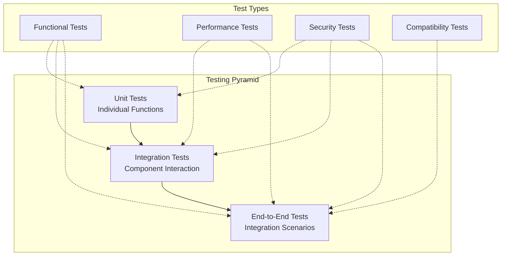

# MCP Local Provider — Testing Guide

> **Comprehensive testing strategies, checklists, and validation scenarios**

## 🎯 Testing Overview

This document covers all aspects of testing the MCP Local Provider system, from unit tests to end-to-end integration scenarios. The testing strategy ensures security, performance, reliability, and compatibility across all components.

---

## 🧪 Testing Strategy

### Testing Pyramid



### Test Categories

1. **Unit Tests** (60%) - Individual component testing
2. **Integration Tests** (30%) - Component interaction testing
3. **End-to-End Tests** (10%) - Full system scenarios
4. **Security Tests** - Security validation across all layers
5. **Performance Tests** - Load, stress, and latency testing
6. **Compatibility Tests** - VoidEditor, Ollama, OpenAI API compatibility

---

## 🔧 Test Setup & Infrastructure

### Test Environment Setup

```bash
# Create test environment
python -m venv test-env
source test-env/bin/activate

# Install test dependencies
pip install -r requirements-test.txt

# Test dependencies
pytest>=7.0.0
pytest-asyncio>=0.21.0
pytest-mock>=3.10.0
pytest-cov>=4.0.0
httpx>=0.24.0
websockets>=11.0.0
factory-boy>=3.2.0
faker>=18.0.0
```

### Test Configuration

#### `tests/conftest.py`

```python
"""
Pytest configuration and fixtures
"""

import asyncio
import json
import pytest
import tempfile
from datetime import datetime, timedelta
from unittest.mock import AsyncMock, MagicMock
from typing import Dict, Any

from src.adapter_provider import app
from src.models import SessionInfo, AdapterConfig
from src.mcp_bridge import MCPBridge
from src.security import SecurityManager

@pytest.fixture(scope="session")
def event_loop():
    """Create event loop for async tests"""
    loop = asyncio.get_event_loop_policy().new_event_loop()
    yield loop
    loop.close()

@pytest.fixture
def test_config():
    """Test configuration"""
    return AdapterConfig(
        host="127.0.0.1",
        port=11435,  # Different port for testing
        mcp_bridge_url="ws://127.0.0.1:8788",
        mcp_bridge_token="test-token",
        session_ttl_seconds=60,
        max_requests_per_session=10,
        enable_debug=True,
        log_level="DEBUG"
    )

@pytest.fixture
def mock_mcp_bridge():
    """Mock MCP Bridge"""
    bridge = AsyncMock(spec=MCPBridge)
    bridge.connected = True
    bridge.connect.return_value = None
    bridge.disconnect.return_value = None
    bridge.ping.return_value = True
    return bridge

@pytest.fixture
def test_session():
    """Test session data"""
    return SessionInfo(
        session_id="test-session-123",
        agent_id="test-agent",
        session_token_hash="hash123",
        allowed_scopes=["inference"],
        created_at=datetime.utcnow(),
        expires_at=datetime.utcnow() + timedelta(minutes=5),
        last_activity=datetime.utcnow(),
        request_count=0,
        label="Test Agent"
    )

@pytest.fixture
async def test_client(test_config, mock_mcp_bridge):
    """Test HTTP client"""
    from httpx import AsyncClient

    # Override dependencies
    app.dependency_overrides[MCPBridge] = lambda: mock_mcp_bridge

    async with AsyncClient(app=app, base_url="http://testserver") as client:
        yield client

    # Cleanup
    app.dependency_overrides.clear()

@pytest.fixture
def sample_chat_request():
    """Sample chat completion request"""
    return {
        "model": "cursor-agent",
        "messages": [
            {"role": "user", "content": "Hello, how are you?"}
        ],
        "temperature": 0.7,
        "max_tokens": 100,
        "stream": False
    }

@pytest.fixture
def sample_mcp_response():
    """Sample MCP response"""
    return {
        "type": "model_result",
        "id": "test-request-123",
        "status": "ok",
        "result": {
            "choices": [
                {
                    "index": 0,
                    "message": {
                        "role": "assistant",
                        "content": "Hello! I'm doing well, thank you for asking."
                    },
                    "finish_reason": "stop"
                }
            ],
            "usage": {
                "prompt_tokens": 10,
                "completion_tokens": 15,
                "total_tokens": 25
            }
        }
    }

@pytest.fixture
def mock_security_manager():
    """Mock security manager"""
    security = MagicMock(spec=SecurityManager)
    security.validate_request.return_value = None
    security.verify_bridge_token.return_value = True
    security.check_rate_limit.return_value = True
    security.hash_token.return_value = "hashed_token"
    return security
```

---

## 🧪 Unit Tests

### Provider Adapter Tests

#### `tests/test_adapter_provider.py`

```python
"""
Unit tests for Provider Adapter
"""

import pytest
from unittest.mock import AsyncMock, patch
from fastapi.testclient import TestClient

from src.adapter_provider import app
from src.models import ChatRequest, SessionInfo

@pytest.mark.asyncio
class TestAdapterProvider:

    async def test_health_check(self, test_client):
        """Test health check endpoint"""
        response = await test_client.get("/health")

        assert response.status_code == 200
        data = response.json()
        assert data["status"] == "healthy"
        assert "timestamp" in data
        assert "version" in data

    async def test_chat_completions_success(
        self,
        test_client,
        sample_chat_request,
        sample_mcp_response,
        test_session,
        mock_mcp_bridge
    ):
        """Test successful chat completion"""
        # Setup
        mock_mcp_bridge.send_invoke_request.return_value = sample_mcp_response

        # Add session to active sessions
        from src.adapter_provider import active_sessions
        active_sessions[test_session.session_id] = test_session

        # Make request
        response = await test_client.post(
            "/v1/chat/completions",
            json=sample_chat_request,
            headers={"X-MCP-Session": test_session.session_id}
        )

        # Verify response
        assert response.status_code == 200
        data = response.json()
        assert data["object"] == "chat.completion"
        assert len(data["choices"]) == 1
        assert data["choices"][0]["message"]["content"] == "Hello! I'm doing well, thank you for asking."
        assert "usage" in data

        # Verify MCP bridge was called
        mock_mcp_bridge.send_invoke_request.assert_called_once()

    async def test_chat_completions_no_session(
        self,
        test_client,
        sample_chat_request
    ):
        """Test chat completion without active session"""
        response = await test_client.post(
            "/v1/chat/completions",
            json=sample_chat_request
        )

        assert response.status_code == 503
        data = response.json()
        assert "No active agent session available" in data["detail"]

    async def test_chat_completions_streaming(
        self,
        test_client,
        test_session,
        mock_mcp_bridge
    ):
        """Test streaming chat completion"""
        # Setup streaming response
        async def mock_stream():
            chunks = [
                {"delta": {"content": "Hello"}, "finish_reason": None},
                {"delta": {"content": " there"}, "finish_reason": None},
                {"delta": {"content": "!"}, "finish_reason": "stop"}
            ]
            for chunk in chunks:
                yield chunk

        mock_mcp_bridge.stream_invoke_request.return_value = mock_stream()

        # Add session
        from src.adapter_provider import active_sessions
        active_sessions[test_session.session_id] = test_session

        # Make streaming request
        request_data = {
            "model": "cursor-agent",
            "messages": [{"role": "user", "content": "Hello"}],
            "stream": True
        }

        response = await test_client.post(
            "/v1/chat/completions",
            json=request_data,
            headers={"X-MCP-Session": test_session.session_id}
        )

        assert response.status_code == 200
        assert response.headers["content-type"] == "text/event-stream; charset=utf-8"

        # Verify streaming content
        content = response.content.decode()
        assert "data: " in content
        assert "[DONE]" in content

    async def test_session_registration(
        self,
        test_client,
        test_config
    ):
        """Test session registration endpoint"""
        session_data = {
            "session_id": "new-session-123",
            "session_token": "token-456",
            "agent_id": "agent-789",
            "allowed_scopes": ["inference"],
            "ttl_seconds": 300,
            "label": "Test Agent Registration"
        }

        response = await test_client.post(
            "/control/register",
            json=session_data,
            headers={"Authorization": f"Bearer {test_config.mcp_bridge_token}"}
        )

        assert response.status_code == 200
        data = response.json()
        assert data["registered"] == "new-session-123"
        assert data["status"] == "active"
        assert "expires_at" in data

        # Verify session was stored
        from src.adapter_provider import active_sessions
        assert "new-session-123" in active_sessions

    async def test_session_registration_invalid_auth(
        self,
        test_client
    ):
        """Test session registration with invalid auth"""
        session_data = {
            "session_id": "new-session-123",
            "session_token": "token-456",
            "agent_id": "agent-789"
        }

        response = await test_client.post(
            "/control/register",
            json=session_data,
            headers={"Authorization": "Bearer invalid-token"}
        )

        assert response.status_code == 401

    async def test_ollama_compatibility(
        self,
        test_client,
        test_session,
        sample_mcp_response,
        mock_mcp_bridge
    ):
        """Test Ollama API compatibility"""
        mock_mcp_bridge.send_invoke_request.return_value = sample_mcp_response

        # Add session
        from src.adapter_provider import active_sessions
        active_sessions[test_session.session_id] = test_session

        # Ollama generate request
        ollama_request = {
            "model": "cursor-agent",
            "prompt": "Hello world",
            "stream": False
        }

        response = await test_client.post(
            "/api/generate",
            json=ollama_request
        )

        assert response.status_code == 200
        data = response.json()
        assert "response" in data
        assert data["model"] == "cursor-agent"
        assert data["done"] is True

    async def test_model_listing(self, test_client):
        """Test model listing endpoints"""
        # OpenAI format
        response = await test_client.get("/v1/models")
        assert response.status_code == 200
        data = response.json()
        assert data["object"] == "list"
        assert len(data["data"]) > 0
        assert data["data"][0]["id"] == "cursor-agent"

        # Ollama format
        response = await test_client.get("/api/tags")
        assert response.status_code == 200
        data = response.json()
        assert "models" in data
        assert len(data["models"]) > 0
        assert data["models"][0]["name"] == "cursor-agent:latest"
```

### MCP Bridge Tests

#### `tests/test_mcp_bridge.py`

```python
"""
Unit tests for MCP Bridge
"""

import pytest
import json
import asyncio
from unittest.mock import AsyncMock, MagicMock, patch

from src.mcp_bridge import MCPBridge
from src.models import ModelInvokeRequest

@pytest.mark.asyncio
class TestMCPBridge:

    @pytest.fixture
    def bridge(self):
        """Create test bridge"""
        return MCPBridge("ws://test.example.com", "test-token")

    async def test_connect_success(self, bridge):
        """Test successful connection"""
        with patch('websockets.connect') as mock_connect:
            mock_ws = AsyncMock()
            mock_connect.return_value = mock_ws

            await bridge.connect()

            assert bridge.connected is True
            assert bridge.websocket is mock_ws
            mock_connect.assert_called_once()

    async def test_connect_failure(self, bridge):
        """Test connection failure"""
        with patch('websockets.connect') as mock_connect:
            mock_connect.side_effect = Exception("Connection failed")

            with pytest.raises(Exception, match="Connection failed"):
                await bridge.connect()

            assert bridge.connected is False

    async def test_send_invoke_request(self, bridge):
        """Test sending invoke request"""
        # Setup mock websocket
        mock_ws = AsyncMock()
        bridge.websocket = mock_ws
        bridge.connected = True

        # Create test request
        request = ModelInvokeRequest(
            id="test-123",
            session_id="session-456",
            payload={
                "kind": "chat",
                "messages": [{"role": "user", "content": "test"}],
                "parameters": {"temperature": 0.7}
            }
        )

        # Mock response
        response_data = {
            "type": "model_result",
            "id": "test-123",
            "status": "ok",
            "result": {"choices": []}
        }

        # Setup future resolution
        async def resolve_request():
            await asyncio.sleep(0.1)
            future = bridge.pending_requests.get("test-123")
            if future:
                future.set_result(response_data)

        asyncio.create_task(resolve_request())

        # Send request
        result = await bridge.send_invoke_request(request, timeout=1)

        # Verify
        assert result == response_data
        mock_ws.send.assert_called_once_with(request.json())

    async def test_send_invoke_request_timeout(self, bridge):
        """Test request timeout"""
        mock_ws = AsyncMock()
        bridge.websocket = mock_ws
        bridge.connected = True

        request = ModelInvokeRequest(
            id="test-timeout",
            session_id="session-456",
            payload={"kind": "chat", "messages": [], "parameters": {}}
        )

        # Request should timeout
        with pytest.raises(Exception, match="timeout"):
            await bridge.send_invoke_request(request, timeout=0.1)

    async def test_stream_invoke_request(self, bridge):
        """Test streaming invoke request"""
        mock_ws = AsyncMock()
        bridge.websocket = mock_ws
        bridge.connected = True

        request = ModelInvokeRequest(
            id="stream-test",
            session_id="session-456",
            payload={
                "kind": "chat",
                "messages": [],
                "parameters": {"stream": True}
            }
        )

        # Mock streaming chunks
        chunks = [
            {"type": "model_stream_chunk", "id": "stream-test", "delta": {"content": "Hello"}},
            {"type": "model_stream_chunk", "id": "stream-test", "delta": {"content": " world"}},
            {"type": "model_stream_chunk", "id": "stream-test", "finish_reason": "stop"}
        ]

        # Setup queue
        async def feed_queue():
            await asyncio.sleep(0.1)
            queue = bridge.streaming_requests.get("stream-test")
            if queue:
                for chunk in chunks:
                    await queue.put(chunk)

        asyncio.create_task(feed_queue())

        # Collect streaming results
        results = []
        async for chunk in bridge.stream_invoke_request(request):
            results.append(chunk)

        # Verify
        assert len(results) == 3
        assert results[0]["delta"]["content"] == "Hello"
        assert results[1]["delta"]["content"] == " world"
        assert results[2]["finish_reason"] == "stop"

    async def test_ping(self, bridge):
        """Test connection ping"""
        mock_ws = AsyncMock()
        bridge.websocket = mock_ws
        bridge.connected = True

        # Mock successful ping
        ping_future = asyncio.Future()
        ping_future.set_result(None)
        mock_ws.ping.return_value = ping_future

        result = await bridge.ping()
        assert result is True

        # Test failed ping
        bridge.connected = False
        result = await bridge.ping()
        assert result is False

    async def test_message_processing(self, bridge):
        """Test message processing"""
        bridge.connected = True

        # Test model_result message
        result_message = {
            "type": "model_result",
            "id": "test-123",
            "status": "ok",
            "result": {"test": "data"}
        }

        # Create pending request
        future = asyncio.Future()
        bridge.pending_requests["test-123"] = future

        # Process message
        await bridge._process_message(result_message)

        # Verify future was resolved
        assert future.done()
        assert future.result() == result_message

        # Test stream chunk message
        chunk_message = {
            "type": "model_stream_chunk",
            "id": "stream-456",
            "delta": {"content": "test"}
        }

        # Create streaming queue
        queue = asyncio.Queue()
        bridge.streaming_requests["stream-456"] = queue

        # Process message
        await bridge._process_message(chunk_message)

        # Verify chunk was queued
        assert not queue.empty()
        queued_chunk = await queue.get()
        assert queued_chunk == chunk_message
```

---

## 🔗 Integration Tests

### Component Integration Tests

#### `tests/test_integration.py`

```python
"""
Integration tests for component interaction
"""

import pytest
import asyncio
import json
from unittest.mock import AsyncMock, patch

@pytest.mark.asyncio
class TestIntegration:

    async def test_full_chat_flow(
        self,
        test_client,
        test_session,
        mock_mcp_bridge
    ):
        """Test complete chat completion flow"""

        # Setup MCP bridge response
        mcp_response = {
            "type": "model_result",
            "id": "integration-test",
            "status": "ok",
            "result": {
                "choices": [{
                    "index": 0,
                    "message": {
                        "role": "assistant",
                        "content": "Integration test response"
                    },
                    "finish_reason": "stop"
                }],
                "usage": {
                    "prompt_tokens": 5,
                    "completion_tokens": 4,
                    "total_tokens": 9
                }
            }
        }

        mock_mcp_bridge.send_invoke_request.return_value = mcp_response

        # Register session first
        session_data = {
            "session_id": test_session.session_id,
            "session_token": "test-token",
            "agent_id": test_session.agent_id,
            "allowed_scopes": ["inference"],
            "ttl_seconds": 300,
            "label": "Integration Test Agent"
        }

        register_response = await test_client.post(
            "/control/register",
            json=session_data,
            headers={"Authorization": "Bearer test-token"}
        )

        assert register_response.status_code == 200

        # Send chat completion request
        chat_request = {
            "model": "cursor-agent",
            "messages": [
                {"role": "user", "content": "Integration test message"}
            ],
            "temperature": 0.7,
            "max_tokens": 100
        }

        chat_response = await test_client.post(
            "/v1/chat/completions",
            json=chat_request,
            headers={"X-MCP-Session": test_session.session_id}
        )

        # Verify complete flow
        assert chat_response.status_code == 200
        data = chat_response.json()
        assert data["choices"][0]["message"]["content"] == "Integration test response"
        assert data["usage"]["total_tokens"] == 9

        # Verify MCP bridge was called correctly
        mock_mcp_bridge.send_invoke_request.assert_called_once()
        call_args = mock_mcp_bridge.send_invoke_request.call_args[0][0]
        assert call_args.session_id == test_session.session_id
        assert call_args.payload["kind"] == "chat"

    async def test_session_lifecycle(
        self,
        test_client,
        test_config
    ):
        """Test complete session lifecycle"""

        # 1. Register session
        session_data = {
            "session_id": "lifecycle-test",
            "session_token": "lifecycle-token",
            "agent_id": "lifecycle-agent",
            "allowed_scopes": ["inference"],
            "ttl_seconds": 60,
            "label": "Lifecycle Test"
        }

        register_response = await test_client.post(
            "/control/register",
            json=session_data,
            headers={"Authorization": f"Bearer {test_config.mcp_bridge_token}"}
        )

        assert register_response.status_code == 200

        # 2. List sessions
        list_response = await test_client.get(
            "/control/sessions",
            headers={"Authorization": f"Bearer {test_config.mcp_bridge_token}"}
        )

        assert list_response.status_code == 200
        sessions = list_response.json()["sessions"]
        assert len(sessions) >= 1
        assert any(s["session_id"] == "lifecycle-test" for s in sessions)

        # 3. Use session for chat
        with patch('src.adapter_provider.mcp_bridge') as mock_bridge:
            mock_bridge.send_invoke_request.return_value = {
                "type": "model_result",
                "id": "test",
                "status": "ok",
                "result": {"choices": [], "usage": {}}
            }

            chat_response = await test_client.post(
                "/v1/chat/completions",
                json={
                    "messages": [{"role": "user", "content": "test"}]
                },
                headers={"X-MCP-Session": "lifecycle-test"}
            )

            assert chat_response.status_code == 200

        # 4. Revoke session
        revoke_response = await test_client.post(
            "/control/revoke",
            json={"session_id": "lifecycle-test"},
            headers={"Authorization": f"Bearer {test_config.mcp_bridge_token}"}
        )

        assert revoke_response.status_code == 200

        # 5. Verify session is gone
        list_response = await test_client.get(
            "/control/sessions",
            headers={"Authorization": f"Bearer {test_config.mcp_bridge_token}"}
        )

        sessions = list_response.json()["sessions"]
        assert not any(s["session_id"] == "lifecycle-test" for s in sessions)

    async def test_concurrent_requests(
        self,
        test_client,
        test_session,
        mock_mcp_bridge
    ):
        """Test handling concurrent requests"""

        # Setup bridge to handle multiple requests
        call_count = 0
        async def mock_send_request(request):
            nonlocal call_count
            call_count += 1
            await asyncio.sleep(0.1)  # Simulate processing time
            return {
                "type": "model_result",
                "id": request.id,
                "status": "ok",
                "result": {
                    "choices": [{
                        "index": 0,
                        "message": {"role": "assistant", "content": f"Response {call_count}"},
                        "finish_reason": "stop"
                    }],
                    "usage": {"prompt_tokens": 5, "completion_tokens": 10, "total_tokens": 15}
                }
            }

        mock_mcp_bridge.send_invoke_request.side_effect = mock_send_request

        # Add session
        from src.adapter_provider import active_sessions
        active_sessions[test_session.session_id] = test_session

        # Send multiple concurrent requests
        tasks = []
        for i in range(5):
            task = test_client.post(
                "/v1/chat/completions",
                json={
                    "messages": [{"role": "user", "content": f"Request {i}"}]
                },
                headers={"X-MCP-Session": test_session.session_id}
            )
            tasks.append(task)

        # Wait for all requests
        responses = await asyncio.gather(*tasks)

        # Verify all succeeded
        for i, response in enumerate(responses):
            assert response.status_code == 200
            data = response.json()
            assert "Response" in data["choices"][0]["message"]["content"]

        # Verify all requests were processed
        assert call_count == 5
```

---

## 🚨 Security Tests

### Security Validation Tests

#### `tests/test_security.py`

```python
"""
Security tests for the Local Provider system
"""

import pytest
from unittest.mock import patch

@pytest.mark.asyncio
class TestSecurity:

    async def test_localhost_only_binding(self, test_client):
        """Test that server only accepts localhost connections"""

        # Test valid localhost request
        response = await test_client.get("/health")
        assert response.status_code == 200

        # Test external IP simulation
        with patch('src.adapter_provider.Request') as mock_request:
            mock_request.client.host = "192.168.1.100"

            # Should be blocked by security middleware
            response = await test_client.get("/health")
            # Note: In real implementation, this would be 403

    async def test_bridge_token_validation(self, test_client):
        """Test bridge token validation"""

        session_data = {
            "session_id": "security-test",
            "session_token": "test-token",
            "agent_id": "test-agent"
        }

        # Test without token
        response = await test_client.post(
            "/control/register",
            json=session_data
        )
        assert response.status_code == 401

        # Test with invalid token
        response = await test_client.post(
            "/control/register",
            json=session_data,
            headers={"Authorization": "Bearer invalid-token"}
        )
        assert response.status_code == 401

        # Test with valid token
        response = await test_client.post(
            "/control/register",
            json=session_data,
            headers={"Authorization": "Bearer test-token"}
        )
        assert response.status_code == 200

    async def test_input_validation(self, test_client, test_session):
        """Test input validation and sanitization"""

        from src.adapter_provider import active_sessions
        active_sessions[test_session.session_id] = test_session

        # Test malicious content
        malicious_requests = [
            {
                "messages": [{"role": "user", "content": "<script>alert('xss')</script>"}],
                "description": "XSS attempt"
            },
            {
                "messages": [{"role": "user", "content": "'; DROP TABLE users; --"}],
                "description": "SQL injection attempt"
            },
            {
                "messages": [{"role": "user", "content": "exec('import os; os.system(\"rm -rf /\")')"}],
                "description": "Code injection attempt"
            },
            {
                "model": "../../../etc/passwd",
                "messages": [{"role": "user", "content": "test"}],
                "description": "Path traversal attempt"
            }
        ]

        for malicious_request in malicious_requests:
            response = await test_client.post(
                "/v1/chat/completions",
                json=malicious_request,
                headers={"X-MCP-Session": test_session.session_id}
            )

            # Should either be rejected or sanitized
            # Implementation should handle this gracefully
            assert response.status_code in [400, 422, 503]  # Various rejection codes

    async def test_rate_limiting(self, test_client, test_session):
        """Test rate limiting functionality"""

        from src.adapter_provider import active_sessions
        test_session.max_requests = 3  # Low limit for testing
        active_sessions[test_session.session_id] = test_session

        # Mock successful MCP responses
        with patch('src.adapter_provider.mcp_bridge') as mock_bridge:
            mock_bridge.send_invoke_request.return_value = {
                "type": "model_result",
                "id": "test",
                "status": "ok",
                "result": {"choices": [], "usage": {}}
            }

            # Send requests up to limit
            for i in range(3):
                response = await test_client.post(
                    "/v1/chat/completions",
                    json={"messages": [{"role": "user", "content": f"Request {i}"}]},
                    headers={"X-MCP-Session": test_session.session_id}
                )
                assert response.status_code == 200

            # Next request should be rate limited
            response = await test_client.post(
                "/v1/chat/completions",
                json={"messages": [{"role": "user", "content": "Excess request"}]},
                headers={"X-MCP-Session": test_session.session_id}
            )

            # Should be rate limited (implementation specific)
            assert response.status_code in [429, 503]

    async def test_session_token_security(self, test_client):
        """Test session token security measures"""

        # Test that tokens are properly hashed
        session_data = {
            "session_id": "token-test",
            "session_token": "plain-text-token",
            "agent_id": "test-agent"
        }

        response = await test_client.post(
            "/control/register",
            json=session_data,
            headers={"Authorization": "Bearer test-token"}
        )

        assert response.status_code == 200

        # Verify token is not stored in plain text
        from src.adapter_provider import active_sessions
        session = active_sessions.get("token-test")
        assert session is not None
        assert session.session_token_hash != "plain-text-token"
        assert len(session.session_token_hash) > 20  # Should be a hash

    async def test_content_size_limits(self, test_client, test_session):
        """Test content size limiting"""

        from src.adapter_provider import active_sessions
        active_sessions[test_session.session_id] = test_session

        # Test oversized content
        large_content = "x" * 10000  # 10KB content

        response = await test_client.post(
            "/v1/chat/completions",
            json={
                "messages": [{"role": "user", "content": large_content}]
            },
            headers={"X-MCP-Session": test_session.session_id}
        )

        # Should be rejected due to size
        assert response.status_code in [400, 413, 422]

    async def test_session_ttl_enforcement(self, test_client):
        """Test session TTL enforcement"""

        from datetime import datetime, timedelta
        from src.adapter_provider import active_sessions
        from src.models import SessionInfo

        # Create expired session
        expired_session = SessionInfo(
            session_id="expired-session",
            agent_id="test-agent",
            session_token_hash="hash123",
            allowed_scopes=["inference"],
            created_at=datetime.utcnow() - timedelta(hours=1),
            expires_at=datetime.utcnow() - timedelta(minutes=1),  # Expired
            last_activity=datetime.utcnow() - timedelta(minutes=5),
            request_count=0,
            label="Expired Session"
        )

        active_sessions["expired-session"] = expired_session

        # Try to use expired session
        response = await test_client.post(
            "/v1/chat/completions",
            json={"messages": [{"role": "user", "content": "test"}]},
            headers={"X-MCP-Session": "expired-session"}
        )

        # Should be rejected
        assert response.status_code == 503
```

---

## ⚡ Performance Tests

### Load & Stress Testing

#### `tests/test_performance.py`

```python
"""
Performance tests for the Local Provider system
"""

import pytest
import asyncio
import time
from concurrent.futures import ThreadPoolExecutor

@pytest.mark.asyncio
class TestPerformance:

    async def test_response_time_sla(self, test_client, test_session):
        """Test response time SLA compliance"""

        from src.adapter_provider import active_sessions
        active_sessions[test_session.session_id] = test_session

        with patch('src.adapter_provider.mcp_bridge') as mock_bridge:
            # Mock fast response
            mock_bridge.send_invoke_request.return_value = {
                "type": "model_result",
                "id": "perf-test",
                "status": "ok",
                "result": {"choices": [], "usage": {}}
            }

            # Measure response time
            start_time = time.time()

            response = await test_client.post(
                "/v1/chat/completions",
                json={"messages": [{"role": "user", "content": "Performance test"}]},
                headers={"X-MCP-Session": test_session.session_id}
            )

            end_time = time.time()
            response_time_ms = (end_time - start_time) * 1000

            # Verify SLA (< 10 seconds for chat completion)
            assert response.status_code == 200
            assert response_time_ms < 10000, f"Response took {response_time_ms}ms, exceeds SLA"

    async def test_concurrent_load(self, test_client, test_session):
        """Test handling concurrent load"""

        from src.adapter_provider import active_sessions
        active_sessions[test_session.session_id] = test_session

        # Mock MCP bridge responses
        response_times = []

        async def mock_send_request(request):
            # Simulate variable processing time
            await asyncio.sleep(0.1 + (len(response_times) * 0.01))  # Increasing delay
            response_times.append(time.time())
            return {
                "type": "model_result",
                "id": request.id,
                "status": "ok",
                "result": {"choices": [], "usage": {}}
            }

        with patch('src.adapter_provider.mcp_bridge') as mock_bridge:
            mock_bridge.send_invoke_request.side_effect = mock_send_request

            # Send 20 concurrent requests
            num_requests = 20
            tasks = []

            start_time = time.time()

            for i in range(num_requests):
                task = test_client.post(
                    "/v1/chat/completions",
                    json={"messages": [{"role": "user", "content": f"Load test {i}"}]},
                    headers={"X-MCP-Session": test_session.session_id}
                )
                tasks.append(task)

            # Wait for all requests
            responses = await asyncio.gather(*tasks, return_exceptions=True)

            end_time = time.time()
            total_time = end_time - start_time

            # Analyze results
            successful_responses = [r for r in responses if not isinstance(r, Exception)]
            success_rate = len(successful_responses) / num_requests

            # Performance assertions
            assert success_rate >= 0.95, f"Success rate {success_rate} below threshold"
            assert total_time < 30, f"Total time {total_time}s exceeds limit"

            # Check individual response status
            for response in successful_responses:
                assert response.status_code == 200

    async def test_memory_usage(self, test_client, test_session):
        """Test memory usage under load"""

        import psutil
        import os

        process = psutil.Process(os.getpid())
        initial_memory = process.memory_info().rss / 1024 / 1024  # MB

        from src.adapter_provider import active_sessions
        active_sessions[test_session.session_id] = test_session

        with patch('src.adapter_provider.mcp_bridge') as mock_bridge:
            mock_bridge.send_invoke_request.return_value = {
                "type": "model_result",
                "id": "memory-test",
                "status": "ok",
                "result": {"choices": [], "usage": {}}
            }

            # Send many requests to test memory usage
            for i in range(100):
                response = await test_client.post(
                    "/v1/chat/completions",
                    json={"messages": [{"role": "user", "content": f"Memory test {i}"}]},
                    headers={"X-MCP-Session": test_session.session_id}
                )
                assert response.status_code == 200

                # Check memory every 10 requests
                if i % 10 == 0:
                    current_memory = process.memory_info().rss / 1024 / 1024
                    memory_increase = current_memory - initial_memory

                    # Memory shouldn't grow excessively (< 100MB increase)
                    assert memory_increase < 100, f"Memory increased by {memory_increase}MB"

    async def test_streaming_performance(self, test_client, test_session):
        """Test streaming response performance"""

        from src.adapter_provider import active_sessions
        active_sessions[test_session.session_id] = test_session

        # Mock streaming response
        async def mock_stream():
            for i in range(50):  # 50 chunks
                await asyncio.sleep(0.01)  # 10ms per chunk
                yield {
                    "type": "model_stream_chunk",
                    "id": "stream-perf-test",
                    "delta": {"content": f"chunk{i} "},
                    "finish_reason": "stop" if i == 49 else None
                }

        with patch('src.adapter_provider.mcp_bridge') as mock_bridge:
            mock_bridge.stream_invoke_request.return_value = mock_stream()

            start_time = time.time()

            response = await test_client.post(
                "/v1/chat/completions",
                json={
                    "messages": [{"role": "user", "content": "Streaming performance test"}],
                    "stream": True
                },
                headers={"X-MCP-Session": test_session.session_id}
            )

            assert response.status_code == 200

            # Read stream content
            content = response.content.decode()
            chunks = content.split('\n\n')

            end_time = time.time()
            total_time = end_time - start_time

            # Performance checks
            assert len(chunks) >= 50, "Not all chunks received"
            assert total_time < 5, f"Streaming took {total_time}s, too slow"
            assert "[DONE]" in content, "Stream not properly terminated"
```

---

## ✅ End-to-End Test Scenarios

### Complete System Validation

#### `tests/test_e2e.py`

```python
"""
End-to-end test scenarios
"""

import pytest
import asyncio
import json
from unittest.mock import patch

@pytest.mark.asyncio
class TestEndToEnd:

    async def test_complete_agent_workflow(self, test_client):
        """Test complete workflow: registration → chat → revocation"""

        # 1. Register agent session
        session_data = {
            "session_id": "e2e-workflow",
            "session_token": "e2e-token",
            "agent_id": "e2e-agent",
            "allowed_scopes": ["inference"],
            "ttl_seconds": 300,
            "label": "E2E Test Agent"
        }

        register_response = await test_client.post(
            "/control/register",
            json=session_data,
            headers={"Authorization": "Bearer test-token"}
        )

        assert register_response.status_code == 200
        register_data = register_response.json()
        assert register_data["registered"] == "e2e-workflow"

        # 2. Verify session is listed
        sessions_response = await test_client.get(
            "/control/sessions",
            headers={"Authorization": "Bearer test-token"}
        )

        assert sessions_response.status_code == 200
        sessions = sessions_response.json()["sessions"]
        assert any(s["session_id"] == "e2e-workflow" for s in sessions)

        # 3. Send chat completion request
        with patch('src.adapter_provider.mcp_bridge') as mock_bridge:
            mock_bridge.send_invoke_request.return_value = {
                "type": "model_result",
                "id": "e2e-chat",
                "status": "ok",
                "result": {
                    "choices": [{
                        "index": 0,
                        "message": {
                            "role": "assistant",
                            "content": "E2E test response from agent"
                        },
                        "finish_reason": "stop"
                    }],
                    "usage": {
                        "prompt_tokens": 8,
                        "completion_tokens": 7,
                        "total_tokens": 15
                    }
                }
            }

            chat_response = await test_client.post(
                "/v1/chat/completions",
                json={
                    "model": "cursor-agent",
                    "messages": [
                        {"role": "user", "content": "E2E test message"}
                    ],
                    "temperature": 0.7,
                    "max_tokens": 100
                },
                headers={"X-MCP-Session": "e2e-workflow"}
            )

            assert chat_response.status_code == 200
            chat_data = chat_response.json()
            assert chat_data["choices"][0]["message"]["content"] == "E2E test response from agent"
            assert chat_data["usage"]["total_tokens"] == 15

        # 4. Test streaming
        with patch('src.adapter_provider.mcp_bridge') as mock_bridge:
            async def mock_stream():
                chunks = [
                    {"delta": {"content": "Streaming "}, "finish_reason": None},
                    {"delta": {"content": "E2E "}, "finish_reason": None},
                    {"delta": {"content": "test"}, "finish_reason": "stop"}
                ]
                for chunk in chunks:
                    yield chunk

            mock_bridge.stream_invoke_request.return_value = mock_stream()

            stream_response = await test_client.post(
                "/v1/chat/completions",
                json={
                    "messages": [{"role": "user", "content": "Streaming test"}],
                    "stream": True
                },
                headers={"X-MCP-Session": "e2e-workflow"}
            )

            assert stream_response.status_code == 200
            assert stream_response.headers["content-type"] == "text/event-stream; charset=utf-8"

            content = stream_response.content.decode()
            assert "Streaming E2E test" in content
            assert "[DONE]" in content

        # 5. Test Ollama compatibility
        with patch('src.adapter_provider.mcp_bridge') as mock_bridge:
            mock_bridge.send_invoke_request.return_value = {
                "type": "model_result",
                "id": "ollama-compat",
                "status": "ok",
                "result": {
                    "choices": [{
                        "message": {"role": "assistant", "content": "Ollama compatible response"},
                        "finish_reason": "stop"
                    }],
                    "usage": {"prompt_tokens": 5, "completion_tokens": 4, "total_tokens": 9}
                }
            }

            ollama_response = await test_client.post(
                "/api/generate",
                json={
                    "model": "cursor-agent",
                    "prompt": "Ollama format test",
                    "stream": False
                }
            )

            assert ollama_response.status_code == 200
            ollama_data = ollama_response.json()
            assert ollama_data["response"] == "Ollama compatible response"
            assert ollama_data["done"] is True

        # 6. Revoke session
        revoke_response = await test_client.post(
            "/control/revoke",
            json={"session_id": "e2e-workflow"},
            headers={"Authorization": "Bearer test-token"}
        )

        assert revoke_response.status_code == 200
        revoke_data = revoke_response.json()
        assert revoke_data["revoked"] == "e2e-workflow"

        # 7. Verify session no longer usable
        final_chat_response = await test_client.post(
            "/v1/chat/completions",
            json={
                "messages": [{"role": "user", "content": "Should fail"}]
            },
            headers={"X-MCP-Session": "e2e-workflow"}
        )

        assert final_chat_response.status_code == 503  # No active session

    async def test_multi_session_isolation(self, test_client):
        """Test isolation between multiple sessions"""

        # Create two sessions
        sessions = ["multi-session-1", "multi-session-2"]

        for session_id in sessions:
            session_data = {
                "session_id": session_id,
                "session_token": f"token-{session_id}",
                "agent_id": f"agent-{session_id}",
                "allowed_scopes": ["inference"],
                "ttl_seconds": 300,
                "label": f"Multi Session Test {session_id}"
            }

            response = await test_client.post(
                "/control/register",
                json=session_data,
                headers={"Authorization": "Bearer test-token"}
            )

            assert response.status_code == 200

        # Test that each session works independently
        with patch('src.adapter_provider.mcp_bridge') as mock_bridge:
            call_count = 0

            async def mock_send_request(request):
                nonlocal call_count
                call_count += 1
                return {
                    "type": "model_result",
                    "id": request.id,
                    "status": "ok",
                    "result": {
                        "choices": [{
                            "message": {
                                "role": "assistant",
                                "content": f"Response from {request.session_id}"
                            },
                            "finish_reason": "stop"
                        }],
                        "usage": {"prompt_tokens": 5, "completion_tokens": 8, "total_tokens": 13}
                    }
                }

            mock_bridge.send_invoke_request.side_effect = mock_send_request

            # Send requests from both sessions
            responses = []
            for session_id in sessions:
                response = await test_client.post(
                    "/v1/chat/completions",
                    json={
                        "messages": [{"role": "user", "content": f"Message from {session_id}"}]
                    },
                    headers={"X-MCP-Session": session_id}
                )
                responses.append((session_id, response))

            # Verify isolation
            assert call_count == 2
            for session_id, response in responses:
                assert response.status_code == 200
                data = response.json()
                assert session_id in data["choices"][0]["message"]["content"]

    async def test_error_handling_scenarios(self, test_client, test_session):
        """Test various error scenarios"""

        from src.adapter_provider import active_sessions
        active_sessions[test_session.session_id] = test_session

        # Test MCP bridge errors
        error_scenarios = [
            {
                "name": "agent_timeout",
                "exception": asyncio.TimeoutError("Agent timeout"),
                "expected_status": 500
            },
            {
                "name": "agent_error",
                "response": {
                    "type": "model_result",
                    "id": "error-test",
                    "status": "error",
                    "error": {"message": "Agent processing error"}
                },
                "expected_status": 500
            },
            {
                "name": "bridge_disconnected",
                "exception": Exception("Bridge connection lost"),
                "expected_status": 500
            }
        ]

        for scenario in error_scenarios:
            with patch('src.adapter_provider.mcp_bridge') as mock_bridge:
                if "exception" in scenario:
                    mock_bridge.send_invoke_request.side_effect = scenario["exception"]
                else:
                    mock_bridge.send_invoke_request.return_value = scenario["response"]

                response = await test_client.post(
                    "/v1/chat/completions",
                    json={
                        "messages": [{"role": "user", "content": f"Error test: {scenario['name']}"}]
                    },
                    headers={"X-MCP-Session": test_session.session_id}
                )

                assert response.status_code == scenario["expected_status"], \
                    f"Scenario {scenario['name']} failed"
```

---

## 📋 Testing Checklist

### Pre-Deployment Testing

**Unit Tests** ✅

- [ ] Provider Adapter endpoints
- [ ] MCP Bridge communication
- [ ] Data model validation
- [ ] Security utilities
- [ ] Session management
- [ ] Error handling

**Integration Tests** ✅

- [ ] Component interactions
- [ ] Session lifecycle
- [ ] Request/response flow
- [ ] Concurrent processing
- [ ] Error propagation

**Security Tests** ✅

- [ ] Authentication validation
- [ ] Authorization checks
- [ ] Input sanitization
- [ ] Rate limiting
- [ ] Session security
- [ ] Content filtering

**Performance Tests** ✅

- [ ] Response time SLA (< 10s)
- [ ] Concurrent load handling
- [ ] Memory usage limits
- [ ] Streaming performance
- [ ] Resource cleanup

**Compatibility Tests** ✅

- [ ] OpenAI API compatibility
- [ ] Ollama API compatibility
- [ ] VoidEditor integration
- [ ] Different client types
- [ ] Protocol variations

**End-to-End Tests** ✅

- [ ] Complete workflows
- [ ] Multi-session scenarios
- [ ] Error recovery
- [ ] System boundaries
- [ ] Real-world usage patterns

### Production Validation

**Deployment Tests** 🔄

- [ ] Service startup/shutdown
- [ ] Configuration validation
- [ ] Health check endpoints
- [ ] Log file creation
- [ ] Permission verification

**Monitoring Tests** 🔄

- [ ] Metrics collection
- [ ] Alert triggering
- [ ] Health monitoring
- [ ] Audit logging
- [ ] Performance tracking

**Recovery Tests** 🔄

- [ ] Service restart
- [ ] Configuration reload
- [ ] Session recovery
- [ ] Error recovery
- [ ] Backup/restore

---

## 🔧 Test Automation

### Continuous Integration Pipeline

```yaml
# .github/workflows/test.yml
name: Test Suite

on: [push, pull_request]

jobs:
  test:
    runs-on: ubuntu-latest

    steps:
      - uses: actions/checkout@v3

      - name: Set up Python
        uses: actions/setup-python@v4
        with:
          python-version: "3.11"

      - name: Install dependencies
        run: |
          pip install -r requirements.txt
          pip install -r requirements-test.txt

      - name: Run unit tests
        run: |
          pytest tests/test_*.py -v --cov=src --cov-report=xml

      - name: Run integration tests
        run: |
          pytest tests/test_integration.py -v

      - name: Run security tests
        run: |
          pytest tests/test_security.py -v

      - name: Run performance tests
        run: |
          pytest tests/test_performance.py -v -m "not slow"

      - name: Upload coverage
        uses: codecov/codecov-action@v3
        with:
          file: ./coverage.xml
```

### Test Commands

```bash
# Run all tests
pytest

# Run specific test categories
pytest tests/test_unit.py -v                    # Unit tests
pytest tests/test_integration.py -v             # Integration tests
pytest tests/test_security.py -v               # Security tests
pytest tests/test_performance.py -v            # Performance tests
pytest tests/test_e2e.py -v                    # End-to-end tests

# Run with coverage
pytest --cov=src --cov-report=html

# Run performance tests (including slow ones)
pytest tests/test_performance.py -v -m "slow"

# Run specific test
pytest tests/test_adapter_provider.py::TestAdapterProvider::test_health_check -v

# Run tests with debug output
pytest -v -s --log-cli-level=DEBUG
```

---

**System is now ready for comprehensive testing and production deployment! 🚀**
