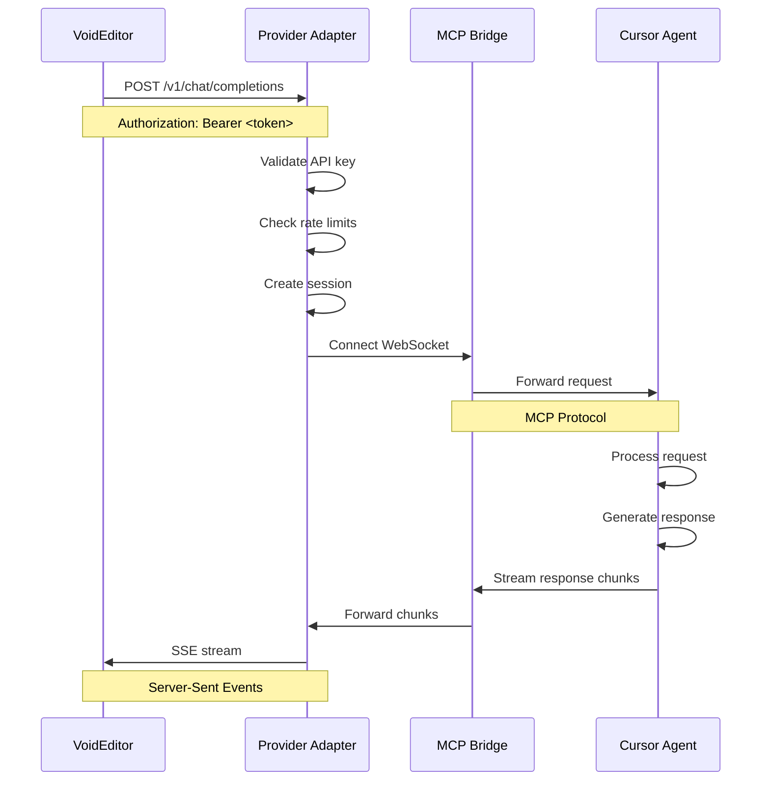

# MCP Local Provider — Arsitektur Sistem

> **Bahasa**: [🇺🇸 English](../ARCHITECTURE.md) | [🇮🇩 Bahasa Indonesia](docs_id/ARCHITECTURE.md)

**Arsitektur sistem detail untuk MCP Local Provider**

## 🏗️ Gambaran Arsitektur

Sistem MCP Local Provider dirancang dengan arsitektur microservice yang memungkinkan agen Cursor berperan sebagai model AI lokal untuk VoidEditor. Arsitektur ini menekankan keamanan, performa, dan kemudahan integrasi.

### Diagram Arsitektur Tingkat Tinggi

```
┌─────────────────────────────────────────────────────────────────┐
│                    Ekosistem Development                        │
├─────────────────────────────────────────────────────────────────┤
│                                                                 │
│  ┌─────────────────┐    ┌─────────────────┐    ┌─────────────────┐
│  │                 │    │                 │    │                 │
│  │   VoidEditor    │◄──►│ Provider Adapter│◄──►│   Cursor IDE    │
│  │                 │    │   (FastAPI)     │    │   (MCP Agent)   │
│  │  - Model Client │    │                 │    │                 │
│  │  - Code Editor  │    │ 127.0.0.1:8788  │    │  - Main Agent   │
│  │  - AI Features  │    │                 │    │  - Context      │
│  │                 │    │                 │    │  - Knowledge    │
│  └─────────────────┘    └─────────────────┘    └─────────────────┘
│         │                        │                        │
│         │                        │                        │
│         │ HTTP/SSE               │ WebSocket              │ MCP
│         │ OpenAI API             │ MCP Protocol           │ Tools
│         │                        │                        │
│         v                        v                        v
│  ┌─────────────────┐    ┌─────────────────┐    ┌─────────────────┐
│  │                 │    │                 │    │                 │
│  │  AI Responses   │    │  Session Store  │    │   MCP Bridge    │
│  │  - Completions  │    │  - Tokens       │    │  - Tool Calls   │
│  │  - Streaming    │    │  - Sessions     │    │  - Message      │
│  │  - Models       │    │  - Rate Limits  │    │    Routing      │
│  │                 │    │                 │    │                 │
│  └─────────────────┘    └─────────────────┘    └─────────────────┘
│                                                                 │
└─────────────────────────────────────────────────────────────────┘
```

---

## 🎯 Komponen Sistem

### 1. VoidEditor (Client)

**Tanggung Jawab:**

- Berperan sebagai client yang menggunakan model AI lokal
- Mengirim request ke Provider Adapter via HTTP
- Menerima respons streaming dalam format OpenAI/Ollama
- Mengelola konfigurasi model dan API key

**Interface:**

```typescript
interface VoidEditorConfig {
  ai: {
    provider: "openai" | "ollama";
    apiUrl: string; // "http://127.0.0.1:8788/v1"
    apiKey: string; // Provider authentication token
    model: string; // "cursor-agent-local"
    maxTokens?: number; // Default: 2048
    temperature?: number; // Default: 0.7
  };
}
```

**Komunikasi:**

- **Protocol**: HTTP/1.1 dengan Server-Sent Events untuk streaming
- **Format**: JSON sesuai OpenAI API specification
- **Auth**: Bearer token di header Authorization
- **Endpoints**: `/v1/chat/completions`, `/v1/models`

### 2. Provider Adapter (FastAPI Server)

**Tanggung Jawab:**

- Mengekspos API kompatibel OpenAI dan Ollama
- Melakukan autentikasi dan otorisasi request
- Mengelola sesi efemeral dengan agen Cursor
- Routing request ke MCP Bridge
- Streaming respons kembali ke VoidEditor

**Arsitektur Internal:**

```python
class ProviderAdapter:
    def __init__(self):
        self.session_manager = SessionManager()
        self.mcp_client = MCPClient()
        self.auth_handler = AuthHandler()
        self.rate_limiter = RateLimiter()
        self.model_registry = ModelRegistry()
```

**API Endpoints:**

- `GET /v1/models` - List available models
- `POST /v1/chat/completions` - Chat completions (streaming/non-streaming)
- `GET /health` - Health check
- `GET /metrics` - Performance metrics
- `POST /v1/completions` - Legacy completions endpoint

### 3. MCP Bridge (Communication Layer)

**Tanggung Jawab:**

- Menjembatani komunikasi antara Provider Adapter dan Cursor Agent
- Mengelola protokol MCP (Model Control Protocol)
- Handling WebSocket connections
- Message serialization/deserialization
- Connection pooling dan reconnection logic

**Protocol Stack:**

```
┌─────────────────┐
│   Application   │  (Model invoke/result messages)
├─────────────────┤
│      MCP        │  (Message framing, session management)
├─────────────────┤
│   WebSocket     │  (Real-time bidirectional communication)
├─────────────────┤
│     HTTP        │  (Upgrade handshake)
├─────────────────┤
│      TCP        │  (Reliable transport)
├─────────────────┤
│       IP        │  (Network layer)
└─────────────────┘
```

### 4. Cursor Agent (AI Model)

**Tanggung Jawab:**

- Berperan sebagai model AI yang merespons request
- Menggunakan konteks dan knowledge dari Cursor IDE
- Generating respons dalam format yang sesuai
- Maintaining conversation state dan context

**Agent Capabilities:**

- Code completion dan generation
- Dokumentasi dan explaining code
- Debugging assistance
- Architecture suggestions
- Best practices recommendations

---

## 📊 Alur Data

### Request Flow (VoidEditor → Cursor Agent)



### Response Flow (Streaming)

```
1. Request Processing
   ┌─────────────────┐    ┌─────────────────┐
   │  VoidEditor     │───►│ Provider Adapter│
   │  HTTP Request   │    │ Validate & Route│
   └─────────────────┘    └─────────────────┘

2. MCP Communication
   ┌─────────────────┐    ┌─────────────────┐
   │ Provider Adapter│───►│   MCP Bridge    │
   │ Session Created │    │ Forward to Agent│
   └─────────────────┘    └─────────────────┘

3. Agent Processing
   ┌─────────────────┐    ┌─────────────────┐
   │   MCP Bridge    │───►│  Cursor Agent   │
   │ Deliver Message │    │ Generate Response│
   └─────────────────┘    └─────────────────┘

4. Streaming Response
   ┌─────────────────┐    ┌─────────────────┐
   │  Cursor Agent   │───►│   VoidEditor    │
   │ Stream Chunks   │    │ Receive & Display│
   └─────────────────┘    └─────────────────┘
```

---

## 🔐 Keamanan Arsitektur

### Defense in Depth

```
┌─────────────────────────────────────────────────┐
│                Network Security                 │
├─────────────────────────────────────────────────┤
│ • Localhost binding (127.0.0.1)                │
│ • Firewall rules                               │
│ • No external network access                   │
└─────────────────────────────────────────────────┘
                        │
┌─────────────────────────────────────────────────┐
│              Application Security               │
├─────────────────────────────────────────────────┤
│ • API key authentication                       │
│ • Token-based sessions                         │
│ • Rate limiting                                │
│ • Input validation                             │
└─────────────────────────────────────────────────┘
                        │
┌─────────────────────────────────────────────────┐
│                Data Security                    │
├─────────────────────────────────────────────────┤
│ • Ephemeral sessions                           │
│ • Memory-only storage                          │
│ • No persistent data                           │
│ • Audit logging                                │
└─────────────────────────────────────────────────┘
```

### Authentication Flow

```python
def authenticate_request(request):
    """Multi-layer authentication"""

    # 1. API Key Validation
    api_key = extract_bearer_token(request.headers)
    if not validate_api_key(api_key):
        raise HTTPException(401, "Invalid API key")

    # 2. Rate Limiting
    client_ip = get_client_ip(request)
    if not rate_limiter.check_limit(client_ip):
        raise HTTPException(429, "Rate limit exceeded")

    # 3. Session Management
    session = create_ephemeral_session(api_key)

    return session
```

---

## 📈 Model Data dan State Management

### Session Data Model

```python
@dataclass
class ProviderSession:
    """Provider session information"""
    session_id: str
    api_key_hash: str
    client_ip: str
    created_at: datetime
    expires_at: datetime
    last_activity: datetime
    request_count: int = 0
    total_tokens: int = 0

    # MCP Connection
    mcp_connection: Optional[WebSocket] = None
    agent_id: Optional[str] = None

    # Model Configuration
    model_name: str = "cursor-agent-local"
    max_tokens: int = 2048
    temperature: float = 0.7
```

### Message Protocol

```python
class MCPMessage(BaseModel):
    """Base MCP message structure"""
    type: str
    id: str
    timestamp: datetime = Field(default_factory=datetime.utcnow)

class ModelInvokeMessage(MCPMessage):
    """Request to invoke model"""
    type: Literal["model_invoke"] = "model_invoke"
    model: str
    messages: List[Dict[str, Any]]
    stream: bool = True
    max_tokens: Optional[int] = None
    temperature: Optional[float] = None

class ModelResultMessage(MCPMessage):
    """Model response result"""
    type: Literal["model_result"] = "model_result"
    choices: List[Dict[str, Any]]
    usage: Optional[Dict[str, int]] = None

class ModelStreamChunk(MCPMessage):
    """Streaming response chunk"""
    type: Literal["model_stream_chunk"] = "model_stream_chunk"
    chunk: Dict[str, Any]
    finished: bool = False
```

---

## ⚡ Performance dan Skalabilitas

### Concurrency Model

```python
class ProviderAdapter:
    """Asyncio-based concurrent processing"""

    async def handle_chat_completion(self, request):
        async with self.session_semaphore:  # Limit concurrent sessions
            session = await self.create_session(request)

            async with self.mcp_pool.acquire() as mcp_client:
                # Process request concurrently
                tasks = [
                    self.validate_request(request),
                    self.setup_mcp_connection(session),
                    self.prepare_response_stream(session)
                ]

                await asyncio.gather(*tasks)

                # Stream response
                async for chunk in self.stream_response(session):
                    yield chunk
```

### Resource Management

**Memory Management:**

- Session data disimpan dalam memory dengan TTL
- Automatic cleanup untuk sesi expired
- Connection pooling untuk WebSocket
- Streaming response untuk efisiensi memory

**Connection Management:**

- WebSocket connection reuse
- Health check untuk koneksi MCP
- Automatic reconnection logic
- Graceful shutdown handling

**Rate Limiting:**

```python
class RateLimiter:
    """Token bucket algorithm"""

    def __init__(self):
        self.requests_per_minute = 60
        self.tokens_per_minute = 100000
        self.buckets = {}

    async def check_limit(self, client_id: str, tokens: int = 1) -> bool:
        bucket = self.buckets.get(client_id, TokenBucket())
        return await bucket.consume(tokens)
```

---

## 🔄 Deployment Architecture

### Single Machine Deployment

```
┌─────────────────────────────────────────────┐
│            Development Machine              │
├─────────────────────────────────────────────┤
│                                             │
│  ┌───────────────┐  ┌───────────────────┐   │
│  │               │  │                   │   │
│  │ Cursor IDE    │  │ Provider Adapter  │   │
│  │ Port: Default │  │ Port: 8788        │   │
│  │               │  │                   │   │
│  └───────────────┘  └───────────────────┘   │
│          │                     │            │
│          │                     │            │
│          └──────MCP Protocol───┘            │
│                                             │
│  ┌───────────────┐                         │
│  │               │                         │
│  │ VoidEditor    │                         │
│  │ Port: Default │                         │
│  │               │                         │
│  └───────────────┘                         │
│          │                                 │
│          │                                 │
│          └──────HTTP API (localhost)───────┘
│                                             │
└─────────────────────────────────────────────┘
```

### Multi-Developer Team

```
┌─────────────────┐    ┌─────────────────┐    ┌─────────────────┐
│   Developer A   │    │   Developer B   │    │   Developer C   │
├─────────────────┤    ├─────────────────┤    ├─────────────────┤
│                 │    │                 │    │                 │
│ Cursor + Void   │    │ Cursor + Void   │    │ Cursor + Void   │
│ Local Provider  │    │ Local Provider  │    │ Local Provider  │
│ Port: 8788      │    │ Port: 8789      │    │ Port: 8790      │
│                 │    │                 │    │                 │
└─────────────────┘    └─────────────────┘    └─────────────────┘
        │                       │                       │
        │                       │                       │
        └───────────────────────┼───────────────────────┘
                                │
                    ┌─────────────────┐
                    │ Shared Resources│
                    ├─────────────────┤
                    │ • Config files  │
                    │ • Token storage │
                    │ • Log aggregator│
                    │ • Monitoring    │
                    └─────────────────┘
```

---

## 🧪 Testing Architecture

### Test Pyramid

```
                    ┌─────────────────┐
                    │       E2E       │
                    │   Integration   │ ← Full system tests
                    └─────────────────┘
                  ┌─────────────────────┐
                  │     Integration     │
                  │   Component Tests   │ ← API tests
                  └─────────────────────┘
                ┌─────────────────────────┐
                │       Unit Tests        │
                │   Individual Classes    │ ← Class/function tests
                └─────────────────────────┘
```

### Test Environment

```python
class TestEnvironment:
    """Isolated test environment"""

    def setup(self):
        # Start test provider adapter
        self.adapter = ProviderAdapter(test_config)

        # Mock MCP client
        self.mcp_mock = AsyncMock()

        # Test session store
        self.session_store = InMemorySessionStore()

        # Rate limiter with high limits
        self.rate_limiter = RateLimiter(
            requests_per_minute=1000,
            tokens_per_minute=1000000
        )
```

---

**Next**: Lihat [API_SPECIFICATION.md](API_SPECIFICATION.md) untuk spesifikasi API yang detail
